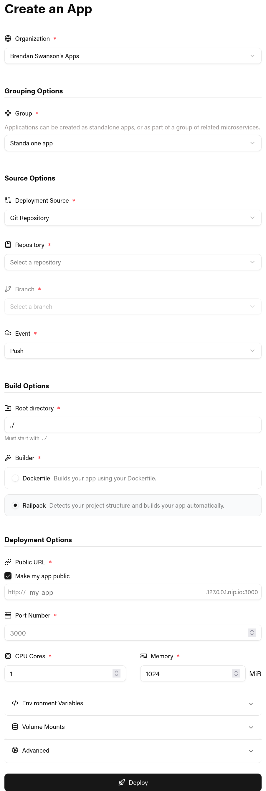
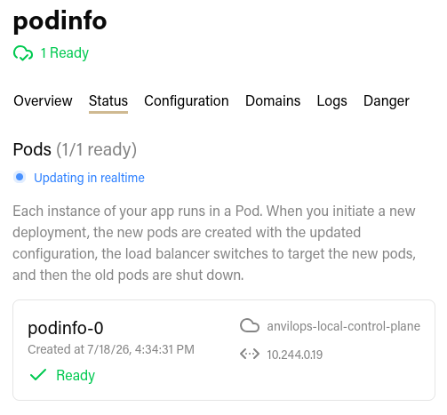
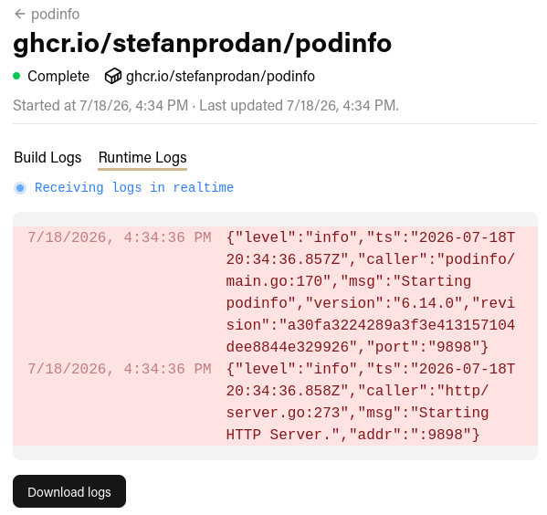
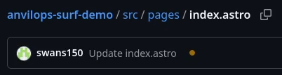
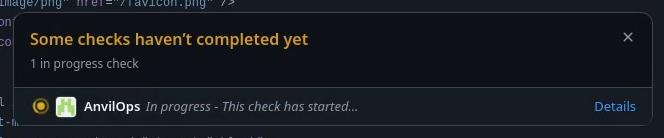
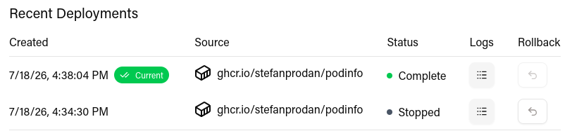
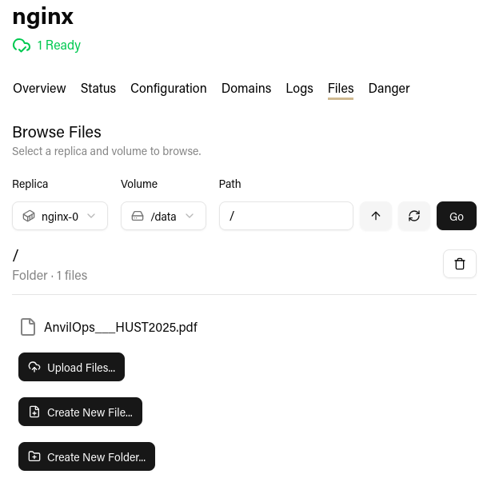
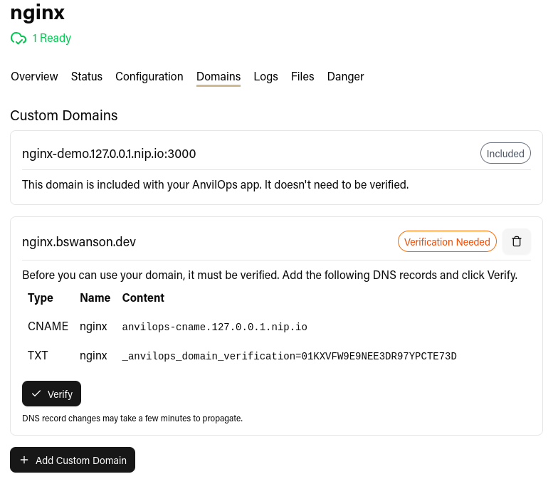
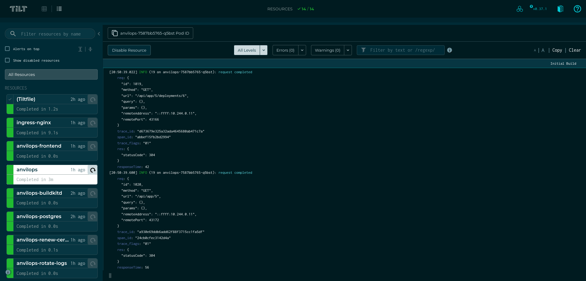
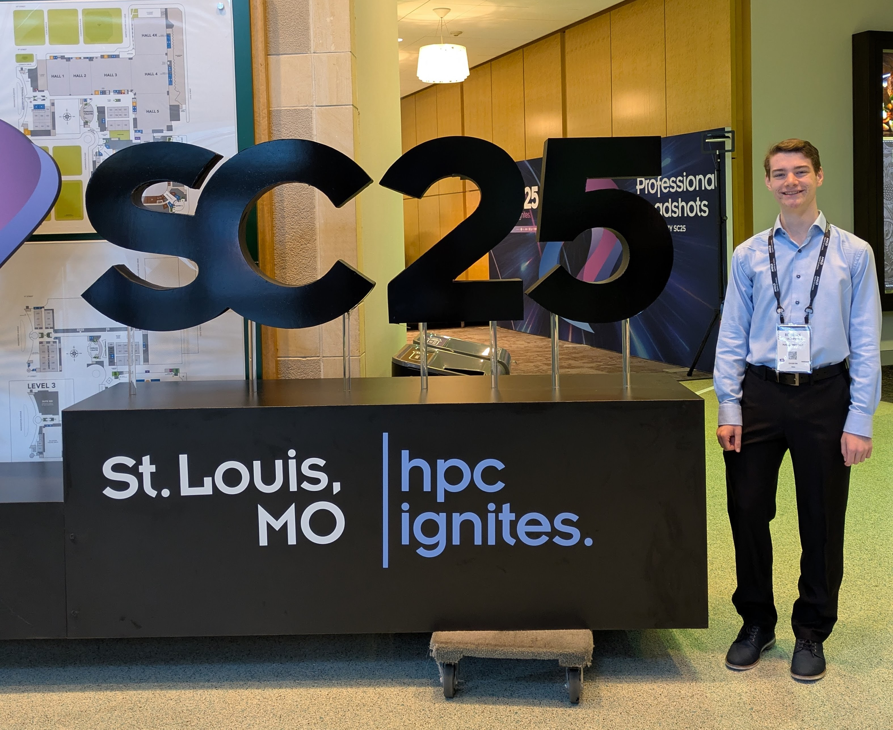

## Background

Purdue University has a high-performance computing center called the Rosen Center for Advanced Computing (RCAC).

In 2020, they received [a grant](https://www.nsf.gov/awardsearch/showAward?AWD_ID=2005632&HistoricalAwards=false) from the National Science Foundation to build [Anvil](https://www.rcac.purdue.edu/anvil), their next HPC cluster, to provide free access users across the country through the [ACCESS](https://access-ci.org/) program.

Using that NSF grant, they run a Research Experience for Undergraduates (REU) program. I had the privilege of participating in this program in the Summer of 2025, and in this post, I'm sharing my experiences and reflections from the program.

## Applying and Interviewing

I found out about the program from NC State's [CSC Student Opportunities](https://webapps.csc.ncsu.edu/student_opportunities/) email list (link requires NCSU login).

The four intern projects were listed on the website, and I was able to choose my top two that I wanted to apply to. I think this made my chances much better, as I already had prior experience with the technologies used in the project I was selected for. The application also included a few short-answer questions about why I wanted to work on the projects I was applying for and what I wanted to get out of my research experience.

I did one video interview with the two mentors for the project. They asked me a few behavioral questions and wanted to know more about my technical experience. I liked how the interview felt more like a conversation than a quiz; there was no technical trivia, just getting to know me.

Out of the 406 people who applied to the program, 8 students were selected, only 2 of which were from Purdue. Half (including myself) were rising sophomores and the other half were rising seniors.

## My Project

Over the summer, another intern and I built a platform-as-a-service for Kubernetes called AnvilOps.

### Background

Kubernetes is a platform for deploying applications and scaling them across many physical machines. It allows the largest companies in the world to run apps with high availability on a global scale, but for newcomers, the deployment process is lengthy, error-prone, and requires too much specialized knowledge. Platform-as-a-service products attempt to fix this by automating the build and deployment process, abstracting away as much of the underlying infrastructure as possible. Users of a platform-as-a-service get to focus on their app's code while the platform handles deployment.

Companies like [Railway](https://railway.com/), [Render](https://railway.com/), and [Heroku](https://www.heroku.com/) do this really well, but they charge you extra for the privilege.
[Vercel](https://vercel.com/) and [Netlify](https://www.netlify.com/) provide a similar service for serverless functions.

There are some existing open-source options for Kubernetes, like [Epinio](https://epinio.io/), but we wanted a nice web interface and needed to deploy resources into users' own Rancher projects to obey their resource limits, so we set out to build our own solution.

### User Flow

To start using AnvilOps, sign in with an OAuth provider. Purdue uses ACCESS CI for Anvil and their own Shibboleth instance for Geddes.

Then, link a GitHub organization or personal account.

To deploy an app, click "Create App" in the dashboard. Then, select an AnvilOps organization, Rancher project, GitHub repository, branch name, port number, and a public URL.

You can choose to build your app with a Dockerfile, or use [Railpack](https://railpack.com/) to build supported languages and frameworks without one.

For most apps, you can leave all the other options at their defaults. If needed, you can also configure environment variables, volume mounts, compute resources, log collection, and gating deployments behind successful GitHub Actions workflows.

With your app configured, click **🚀 Deploy** and watch it deploy in your Rancher project. You can check the Status tab for realtime updates on the created Kubernetes resources and the Logs tab for logs from your app's most recent deployment.

When you push a commit to the linked GitHub repository, AnvilOps will automatically clone the repository, build a new container image, and update the created Kubernetes resources to roll out the new image on the cluster.

AnvilOps remembers every version of your application, called Deployments, allowing you to easily rollback to previous versions.

Your app is accessible via a subdomain automatically, and you can enroll a custom domain from the dashboard.

### Tech Stack

AnvilOps is comprised of a frontend, a backend, a database, and an image builder.

**The frontend** is a React (TypeScript) app built with TailwindCSS and shadcn/ui. We chose these because they make it quick and easy to build a decent-looking UI.

**The backend** is an Express (Node.js with TypeScript) app. We chose TypeScript so that we could have the simplicity of writing the frontend and backend in the same language. We wrote an OpenAPI specification to define the structure of API requests and responses, which helped us catch mismatched data types and structures at build time instead of at runtime. Using an OpenAPI specification also allows us to automatically validate all requests before our API handlers see them. The backend is entirely stateless, and it reads and writes data from/to the database and the Kubernetes API.

I enjoyed using the new Node.js `--env-file`, `--watch`, and `--experimental-strip-types` flags with this project to load environment variables from a `.env` file, restart when source files change, and run TypeScript files, respectively. I'm glad that improvements in alternative runtimes like Bun and Demo encouraged the Node.js team to implement these features so that we don't have to rely on third-party packages like `dotenv`, `nodemon`, and `ts-node`.

**The database** is Postgres. The only Postgres-exclusive feature we use is `LISTEN`/`NOTIFY` to subscribe to new application logs being received.

**The image builder** is a two-part system. Image building itself is handled by BuildKit, and we spawn Kubernetes `Job`s to clone repositories and send build context to the BuildKit daemon. If the user does not have a Dockerfile, we use Railpack to generate a BuildKit build plan instead of going through the standard Dockerfile frontend. The Kubernetes Jobs communicate with the Backend to let it know when builds start and complete.

### Interesting features I worked on

**File browser**

AnvilOps spins up a pod on demand that mounts the same PersistentVolume that an app is using. Then, the user can view, edit, upload, and download files from a nice web UI.

**Custom domains**

Users can add a custom domain to their app. We ask the user to add two DNS records: a TXT record for verification and an A or CNAME record to point the domain to AnvilOps. Then, we automatically generate a TLS certificate for the domain using Let's Encrypt's ACME protocol.

**GitHub App integration**

GitHub allows you to create "Apps" to deeply integrate with their platform. We use a GitHub app to receive webhooks for all connected repositories and to generate tokens for all our other GitHub API operations.

**Build pipeline**

When a commit is pushed to a repository, AnvilOps automatically rebuilds the user's application from source. We generate a clone URL and pass it to a new `Job` that clones the repository, generates configurations with Railpack if necessary, and passes context to a BuildKit daemon. The BuildKit daemon builds the image and pushes it to the registry, and then the build job notifies the backend that the build is complete. Finally, the backend updates the app's configuration, regenerates the Kubernetes manifests, and applies them to the cluster to trigger the rolling update.

**Log storage system**

By default, AnvilOps captures logs from users' applications and displays them on the web dashboard. We do this by mounting a small static binary in the user's container that wraps their process and pipes the logs to the AnvilOps backend. The backend adds them to a Postgres table, and we use Postgres's `LISTEN` and `NOTIFY` to pass realtime updates to clients using server-sent events (SSE).

This might seem like a strange way to do it, especially considering there are fantastic existing solutions like Logstash and Fluentd. However, we wanted AnvilOps to be as simple to install as possible, and we wanted logging to work regardless of Kubernetes distribution or container runtime. This means we need to do everything inside the cluster to avoid making assumptions about the host and cluster setup.

The log collection system can be disabled in the event of an especially high log volume or a compatibility issue. In that case, AnvilOps follows logs using the Kubernetes API when the user views them in the dashboard. However, they aren't saved, because that would require a persistent connection to the Kubernetes API server for each pod, which could put a lot of load on the API server as the number of apps increases.

**Helm chart distribution**

AnvilOps is distributed as a Helm chart, which means you can configure it with one YAML file and install it with one command.

**Tilt development environment**

Tilt is an amazing technology for local Kubernetes development. I first discovered it from someone in the Minestom community and adopted it for BlueDragon, and I had to have it for AnvilOps because of the superior developer experience. It allows you to define resources that get automatically rebuilt and redeployed when their source files change. AnvilOps is now exclusively developed in Tilt because it's so frictionless to set up on a new machine.

### Future Work

AnvilOps is a fully-featured PaaS with support for the majority of common workloads. However, there are still quite a few areas of improvement. For example:

- Creating automatic, ephemeral preview deployments from pull requests
- More templates for common auxiliary services like databases
- A system for reusing environment variables between applications
- Cron jobs
- Public endpoints for non-HTTP services
- Attaching to containers from the web interface or via the terminal
- FTP support for persistent volumes

## PEARC25: My First Conference

As a part of the Anvil REU program, I got to go to the PEARC25 supercomputing conference as a part of their student program!
It was the highlight of my summer, and I learned so much about academic research, high-performance computing careers, and what other HPC labs are exploring.

My favorite parts were:

- The paper review session: as a part of the student program, we did an activity where we played the role of a peer reviewer on a paper that had actually been submitted to the conference. It really helped demystify the review process for me.
- The poster session: I had the opportunity to talk to students and researchers about their projects. It's always insightful asking someone questions about a project that they spent months and months working on.

## Presenting at SC25

As the summer wrapped up, we wrote a paper to submit to _[Supercomputing 2025](https://sc25.supercomputing.org/)_'s [HUST (HPC User Support Tools)](https://hust-workshop.github.io/) workshop. They accepted it on the condition that rewrote it as a short paper, so in November, we went to St. Louis and presented our work!

Here's a copy of [the paper](/content/blog/anvil-reu-2025/AnvilOps___HUST2025___Short_CameraReady.pdf) and [the slides](/content/blog/anvil-reu-2025/AnvilOps_SC25_Presentation.pdf), and here's [the demo](https://youtu.be/4y7bH03m3T0) from the presentation.

## PEARC26

Short papers weren't included in the proceedings at SC25, and we still wanted to get our work published, so we submitted it to [PEARC26](https://pearc.acm.org/pearc26/). It ended up getting accepted as a short paper in the Systems: Infrastructure and Middleware track. [Here's a copy](/content/blog/anvil-reu-2025/AnvilOps___PEARC26-short.pdf) of the new paper.

## Wrapping Up

### Working in an Academic Environment

My workday was structured much differently than I expected. We met with our project mentors once a week to discuss progress, but they were focused much more on the outcome than the process. They had an idea of what they wanted from the platform, but we were free to add the features that we wanted and choose how we wanted to architect them. This was a blessing and a curse: it resulted in a really fun experience since we basically did what we wanted every day, but we did have to refactor the app quite a bit in the latter half of the internship as it grew to make it easier to test and maintain, which could have been avoided if we had some more guidance.

### Firsts

This program was my first time:

- Working in a professional environment as a software developer
- Getting paid to write code
- Going to a conference
- Writing a research paper
- Delivering a 30-minute presentation
- Living outside of North Carolina
- [Watching wolves, bison, and foxes eat watermelon](https://visitwolfpark.org/)

### Thank You

The Anvil REU program was an unforgettable experience. It was the perfect opportunity for me to build up my software engineering, technical writing, and communication skills in a fun, constructive environment alongside other motivated peers. A special thanks to:

- My fellow intern, Emma Zheng, and the rest of the cohort
- My mentors, LJ Lumas and Haniye Kashgarani
- The program director, Amanda Hassenplug
- The PEARC25 student program committee
- The track chairs and reviewers for HUST25 and PEARC26
