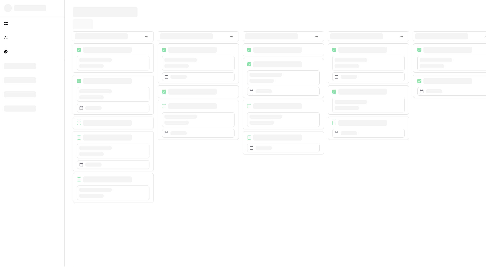
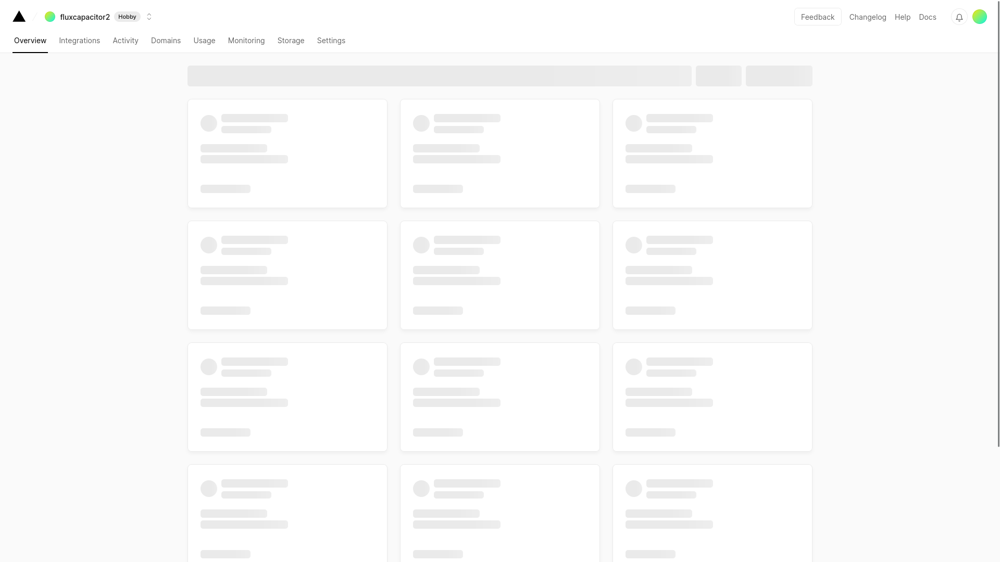
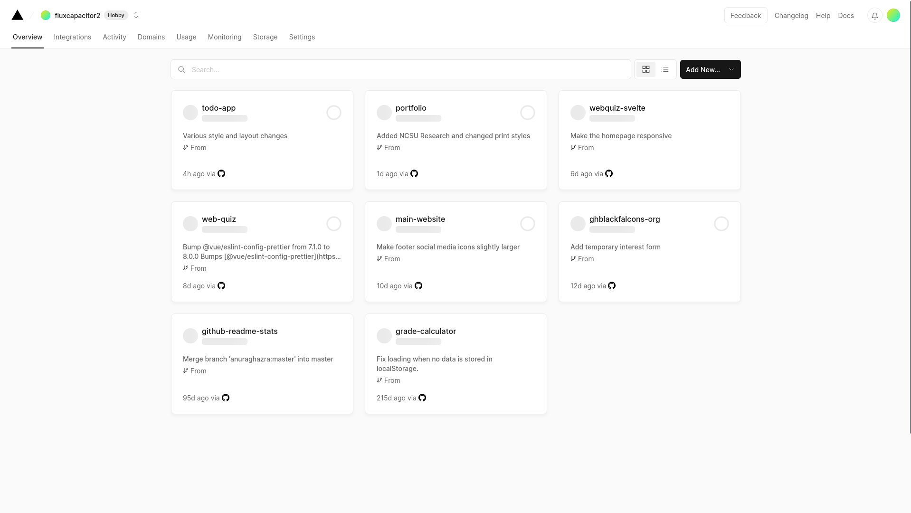
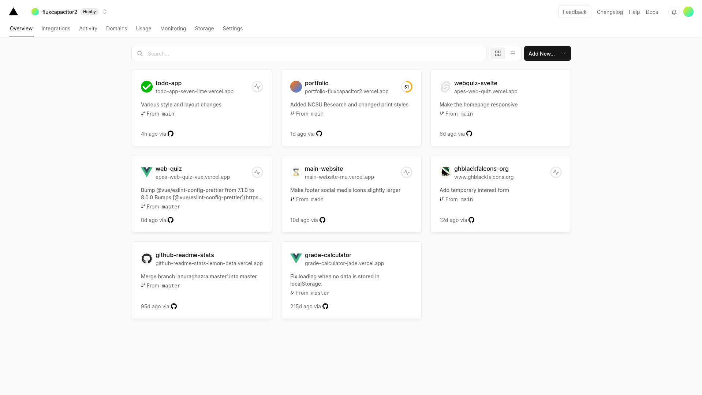
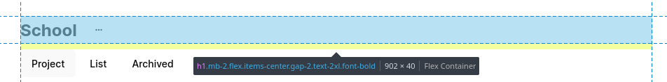
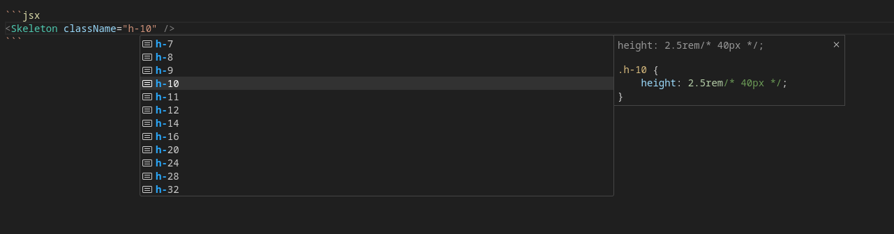
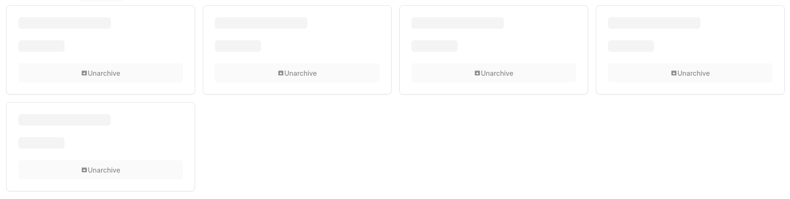
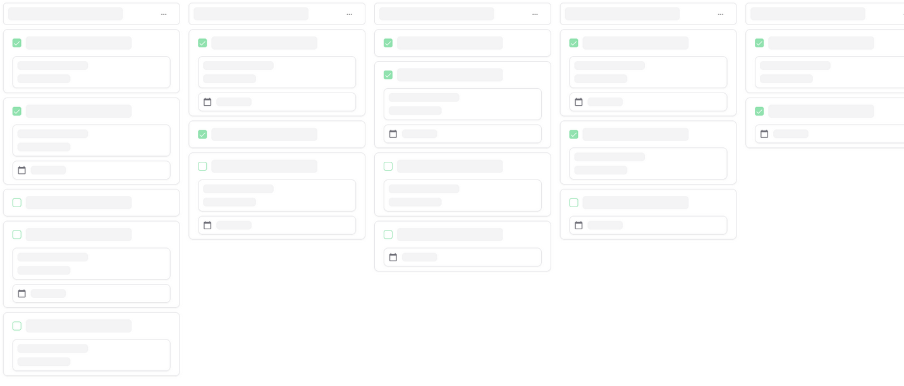

## What is a Skeleton?

Skeletons are low-fidelity representations of what a page or component will look like when it's done loading. It's a tactic used by some of the most popular websites and apps out there, such as YouTube, Facebook, Twitter, and LinkedIn.



As content loads, it should be progressively shown rather than waiting for the full page to be ready. This is why, when done correctly, skeletons can make a website seem so _fast_. My favorite example of this is [Vercel](https://vercel.com/)'s dashboard:

<figure>



  <figcaption>Stage 1 - Initial skeleton</figcaption>
</figure>
<figure>



  <figcaption>Stage 2 - Projects loaded</figcaption>
</figure>
<figure>



  <figcaption>
    Stage 3 - Domains, branches, and other extra information loaded
  </figcaption>
</figure>

## Why Should You Use Skeletons?

1. **Faster perceived loading times** - If your data loads quickly, research has shown that users typically perceive loading times to be faster when apps use skeletons instead of loading spinners. They can make users focus on the content instead of the amount of time they've spent waiting.
2. **Optimizing CLS** - Cumulative layout shift is the measure of how "stable" your page is. If you have content popping in as it loads without defining its size, it will increase your CLS. Implementing a skeleton forces you to estimate the sizes of your components, and if implemented correctly, they can help you reduce CLS on your website.

## Why Shouldn't You Use Skeletons?

1. If you are fetching data on the server, skeletons typically aren't necessary &mdash; unless you're using something like an [instant loading state](https://nextjs.org/docs/app/building-your-application/routing/loading-ui-and-streaming#instant-loading-states) while your app is rendering on the server.
2. If your data takes a long time to load, skeletons may actually [make load times seem longer to your users](https://www.viget.com/articles/a-bone-to-pick-with-skeleton-screens/).

## Implementing a Skeleton Loader in React

### The Skeleton Component

When I wanted to implement skeleton loaders in my [todo list app](https://todo.bswanson.dev), I originally created my own component. With [Tailwind](https://tailwindcss.com/), the process is extremely simple.

```jsx caption="Make sure you assign it a width and height!"
const Skeleton = () => (
  <div className="h-8 w-64 animate-pulse rounded-md bg-gray-500/50" />
);
```

If you want the size to be customizable, you can let the component accept a `className`:

```tsx
const Skeleton = ({ className }: { className: string }) => (
  <div className={clsx("animate-pulse rounded-md bg-gray-500/50", className)} />
);
```

_`clsx` is a utility for combining class names. You can also just concatenate the `className` prop value to the div's `className`, or use a tool called [`tailwind-merge`](https://www.npmjs.com/package/tailwind-merge) to avoid style conflicts._

The key here is the `animate-pulse` class. If we look in the generated CSS, we see that it's a very simple animation:

```css caption="The source code for TailwindCSS's pulse animation"
@keyframes pulse {
  0%,
  100% {
    opacity: 1;
  }
  50% {
    opacity: 0.5;
  }
}

.animate-pulse {
  animation: pulse 2s cubic-bezier(0.4, 0, 0.6, 1) infinite;
}
```

You can also use the [`shadcn/ui` component](https://ui.shadcn.com/docs/components/skeleton) which essentially does the same thing.

### Some Tips For Creating Layouts

Now that you have a basic composable, it's time to re-create your layouts.

Sizing your skeleton components properly is the key to making a good-looking loading state. In your fully-loaded state, open the developer tools and inspect the element you would like to make a skeleton for. Your browser should give you the dimensions of its bounding box:

<figure>



  <figcaption>This title element is 902x40 pixels.</figcaption>
</figure>

Then, you can assign a width and height to your skeleton element to match:

```jsx
<Skeleton className="h-10 w-48" />
```

<figure>



  <figcaption>

If you are using VSCode and the [Tailwind CSS
IntelliSense](https://marketplace.visualstudio.com/items?itemName=bradlc.vscode-tailwindcss)
plugin, you will get autocomplete and unit conversions from Tailwind units
to pixels.

  </figcaption>
</figure>

For most text-based elements, the text won't take up the full box, so you can replace some of the height with vertical margin:

```jsx
<Skeleton className="w-48 h-8 my-1">
```

Now, combining these elements into a layout becomes very simple. Here's an example from my [todo list app](https://todo.bswanson.dev/) using [shadcn/ui](https://ui.shadcn.com/):

```jsx
const ArchivedSkeleton = () => (
  <div className="grid grid-cols-1 gap-4 md:grid-cols-2 lg:grid-cols-3 xl:grid-cols-4">
    {new Array(5).fill(null).map((_, i) => (
      <Card key={i}>
        <CardHeader>
          <CardTitle>
            <Skeleton className="h-6 w-48" />
          </CardTitle>
        </CardHeader>

        <CardContent>
          <Skeleton className="h-6 w-24" />
        </CardContent>
        <CardFooter>
          <Button variant="secondary" disabled className="w-full">
            <MdUnarchive /> Unarchive
          </Button>
        </CardFooter>
      </Card>
    ))}
  </div>
);
```



And a more complicated example:

```tsx
const ProjectSkeleton = () => (
  <div className="ml-2 flex">
    {new Array(5).fill(null).map((_, i) => (
      <div className="mr-4 flex w-80 snap-center flex-col rounded-lg" key={i}>
        {/* Column */}
        <div className="border-border relative mb-2 flex h-10 w-full items-center justify-between rounded-md border pl-2">
          <Skeleton className="h-6 w-52" /> {/* Column title */}
          <div className="absolute inset-y-0 right-2">
            <Button variant="ghost" size="icon" disabled>
              {/* "More options" button */}
              <MdMoreHoriz />
            </Button>
          </div>
        </div>
        <div className="flex w-80 flex-col gap-2">
          {/* List of cards */}
          {new Array([5, 3, 4, 3, 2][i]).fill(null).map((_, j) => (
            <Card key={j}>
              <CardContent className="p-4 py-2">
                <div className="flex gap-2">
                  <div className="grid h-8 items-center">
                    <Checkbox disabled checked={j < 2} />
                  </div>
                  <Skeleton className="mt-1 h-6 w-48" />
                </div>
                {(i + j + 1) % 3 !== 0 && (
                  <Card className="mt-2">
                    {/* Some cards have a description */}
                    <CardContent className="flex flex-col gap-2 p-2">
                      <Skeleton className="h-4 w-32" />
                      <Skeleton className="h-4 w-24" />
                    </CardContent>
                  </Card>
                )}
                {(i + j) % 2 !== 0 && (
                  <Card className="mt-2">
                    {/* Some cards have a due date */}
                    <CardContent className="flex gap-2 p-2">
                      <MdCalendarToday className="text-muted-foreground" />
                      <Skeleton className="h-4 w-16" />
                    </CardContent>
                  </Card>
                )}
              </CardContent>
            </Card>
          ))}
        </div>
      </div>
    ))}
  </div>
);
```

In this example, I wanted some tasks to have due dates and others to have descriptions. The simplest way to make an even-looking distribution was to create a formula with the row and column indexes (`i` and `j`):

```ts
// Show a description if the following evaluates to true:
(i + j + 1) % 3 !== 0;

// Show a due date if the following evaluates to true:
(i + j) % 2 !== 0;
```

Also, the array that I iterate over indicates the amount of cards in each column:

```ts
// The first column has 5 cards, then the second has 3, then 4, ...
new Array([5, 3, 4, 3, 2][i]).fill(null);
```

Finally, for more variability, the first two cards in each column had a checked checkbox:

```tsx
<Checkbox disabled checked={j < 2} />
```

Altogether, this produces a beautiful skeleton that gives users an idea of what the content will look like when it's done loading:


<small>

By the way, if you want to use this app, check it out
[here](https://todo.bswanson.dev)! It's open-sourced [on
GitHub](https://github.com/FluxCapacitor2/todo/).

</small>
