> This guide assumes you are using Next.js to build your website and GitHub to host your repository.

## What is App Service?

Azure App Service is a managed PaaS (platform-as-a-service) product from Microsoft for stateful or long-running web services.
It manages the hardware, operating system, and runtime for you so that you only have to worry about your application code.
It supports Node.js, PHP, Python, ASP.NET, ASP.NET Core, Java, and containers out of the box.

App Service also allows you to mount files from an Azure file share and perform [load testing](https://azure.microsoft.com/en-us/products/load-testing/).

For more information, see [their official documentation](https://learn.microsoft.com/en-us/azure/app-service/overview).

## Why use App Service?

### Compared to Serverless Platforms

1. Costs are much more predictable when you pay for a consistent amount of compute instead of per function execution or edge request.
2. App Service hosts a server 24/7, so you do not have to worry about experiencing [cold starts](https://azure.microsoft.com/en-us/blog/understanding-serverless-cold-start/) when your application stops receiving requests for ~15 minutes.
3. You can run backgroud jobs and long-running tasks on App Service, like WebSocket servers or simple task queues. Serverless functions currently time out after about 60 minutes on [Google Cloud Functions](https://cloud.google.com/functions/docs/configuring/timeout), 15 minutes on [AWS Lambda](https://docs.aws.amazon.com/lambda/latest/dg/configuration-timeout.html), or 3 minutes, 50 seconds on [Azure Functions](https://learn.microsoft.com/en-us/azure/azure-functions/functions-scale#timeout). Azure Web Apps do not have this limitation.

### Compared to VPS Providers

App Service is a PaaS, so it provides abstractions over a regular [VPS](https://cloud.google.com/learn/what-is-a-virtual-private-server):

1. App Service automatically provisions a domain and TLS certificate for you, so you don't have to set up [Certbot](https://letsencrypt.org/getting-started/) or another third-party certificate provider.
2. With App Service, deployments are automated with GitHub Actions. A workflow will upload your build artifacts, and an agent on your App Service instance will download the files and run your updated application. New deployments replace old ones without interfering with them.

### Compared to Other Cloud Providers

1. Azure is one of the big three cloud providers, and it is known for its reliability. They provide [SLAs](https://www.microsoft.com/licensing/docs/view/Service-Level-Agreements-SLA-for-Online-Services?lang=1&year=2023) that guarantee a certain uptime percentage, and they will repay you when downtime does occur.
2. Azure Web Apps can connect to Azure virtual networks. If you have a database or service that cannot be exposed to the public internet, you can host it on Azure behind a virtual network and allow your Web App to connect to it securely.

### Downsides

1. While App Service can auto-scale, scaling will be slower than a serverless platform when you experience a huge, rapid spike in traffic.
2. If your app receives very little traffic, you will likely pay more with App Service since it runs a server 24/7. App Service Plans currently [start at $12.96/month](https://azure.microsoft.com/en-us/pricing/details/app-service/linux/) for a B1 in the East US region.

## Step 1: Creating the App Service Plan

If you already have an App Service Plan, skip this step.

An [App Service Plan](https://learn.microsoft.com/en-us/azure/app-service/overview-hosting-plans) (ASP) is a unit of compute that you use to run apps. The apps that run on an App Service Plan are typically called [Web Apps](https://azure.microsoft.com/en-us/products/app-service/web), but in the Azure portal, they are sometimes (confusingly) referred to as App Services.

Keep in mind the distinction:

1. The **App Service Plan** provides the compute and storage. This is what you are billed for.
2. **Web Apps** are created inside an App Service Plan. You can create as many Web Apps as you want per ASP, but they will share compute resources with other apps on the same Plan.

To create an App Service Plan from the Azure portal, click "Create a Resource" in the top section below the navigation:

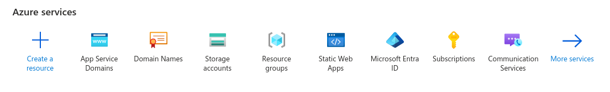

Search for "App Service Plan":

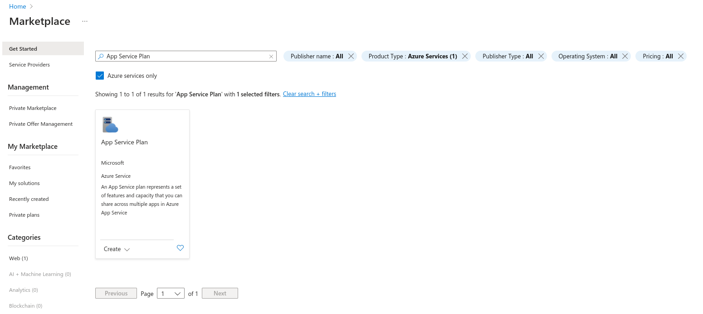

Click on it and click "Create":

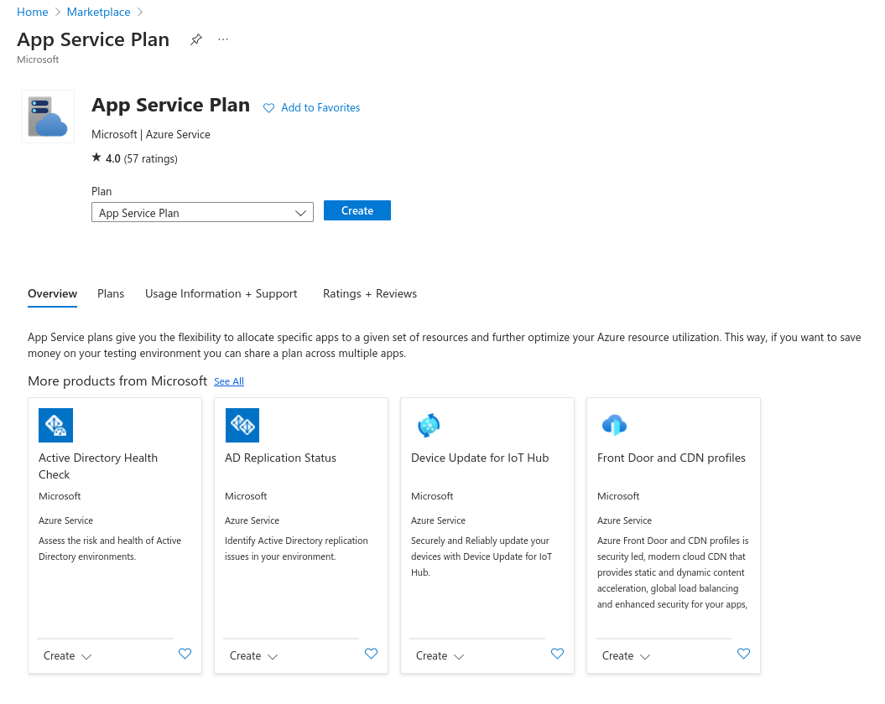

Input your subscription and resource group. Then, give the ASP a name:

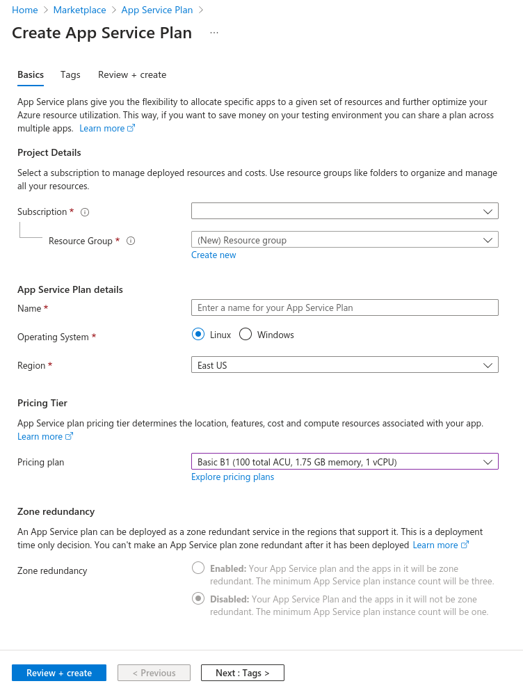

**Make sure the Operating System is set to Linux**! Linux plans are much cheaper than Windows plans due to licensing costs.

The "Shared" plans only get between 60 and 240 CPU minutes per day, so I recommend using a Basic (B-series) or higher for your Next.js app.

Now, click "Review + create" at the bottom:

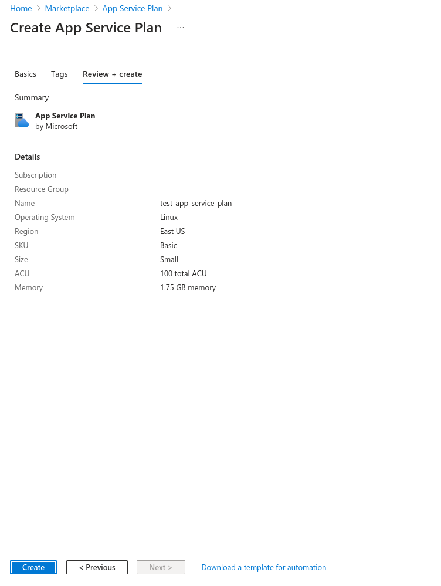

Finally, click "Create".

Once your ASP is done provisioning, proceed to the next step.

## Step 2: Creating the Web App

Go back to the Azure Portal homepage and click "Create a resource" again:


Search for "Web App" and check the "Azure services only" box:

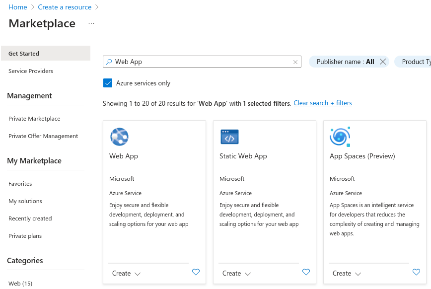

Click the first option, then click "Create".

### Basics

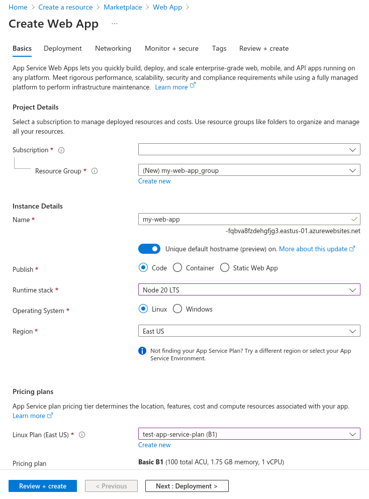

Under the "Basics" tab, give your web app a name. This name will be used to generate a subdomain for your site. You can add custom domains later.

Set the Runtime Stack to Node LTS. Make sure the Operating System and Region are the same as the App Service Plan you just created.

Then, select your App Service Plan.

### Deployment

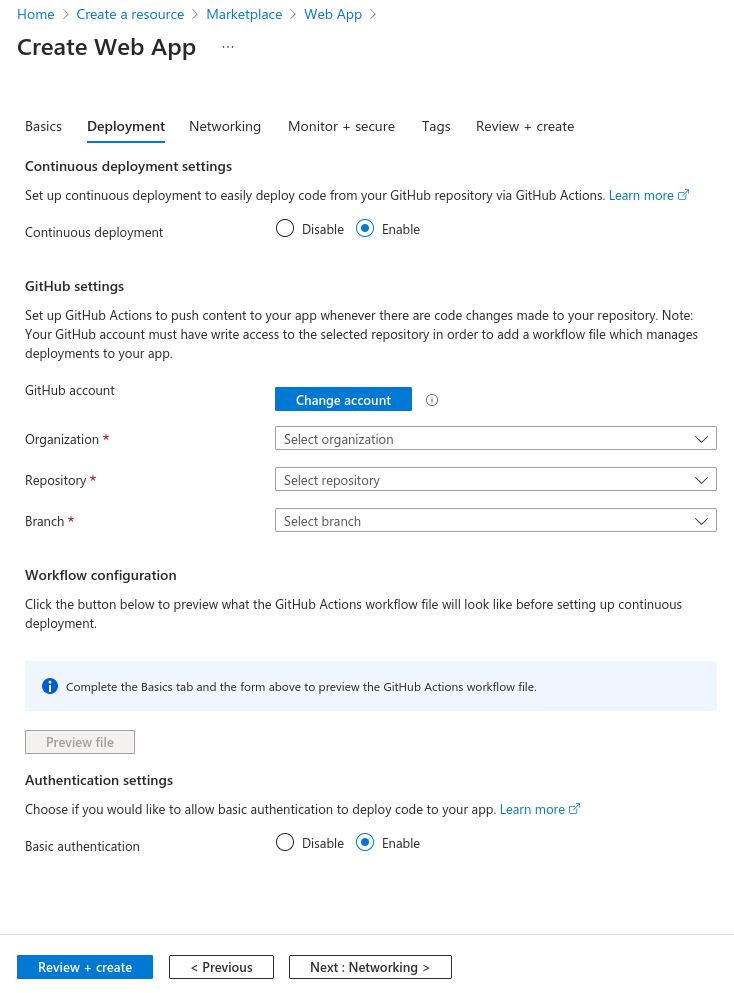

Select the "Deployment" tab. Enable Continuous deployment, sign in to your GitHub account, and find your repository.
Your branch is likely `main` or `master`. This is the branch that deployments are generated from. You can always change it later
by editing the workflow file it generates.

To get your workflow file to look like mine, enable Basic Authentication. This is slightly less secure, but it is simpler, so we will be using it for the purposes of this guide. It is still very unlikely that anyone will guess your Basic Authentication credentials, and if you only use them via GitHub Actions, nobody will see them. They will be added to GitHub automatically as a repository secret.

### Other Settings

- The wizard automatically creates Application Insights and Log Analytics resources for you. If you do not want to incur the minimal extra cost,
  you can disable this under the "Monitor + secure" tab.
- If you want to connect to a virtual network, you can do so under the "Networking" tab by enabling network injection, selecting a virtual network, and selecting "Enable VNet integration" under "Outbound access".

### Creating the Resource

Finally, go to the "Review + create" tab and click "Create".

Because you enabled continuous deployment, a GitHub Actions workflow file will be committed to your repository using your GitHub account.
We will update this in Step 4 to work with a Next.js app.

## Step 3: Setting Up Standalone Output

In your `next.config.(m)js` file, add the following property:

```json
output: "standalone"
```

<small>

See the [Next.js documentation](https://nextjs.org/docs/app/api-reference/next-config-js/output#automatically-copying-traced-files) for standalone mode.

</small>

Standalone mode uses output file tracing with Vercel's [nft](https://github.com/vercel/nft) library to crawl your app's imports and only include the dependencies you use. Then, it copies the output to the `.next/standalone` folder in your project. Finally, it creates a `server.js` file that **allows you to run Next.js as a Node.js server** instead of with a serverless runtime like Vercel.

By using standalone mode, we:

1. Reduce the size of the deployment that is uploaded to App Service
2. Automatically create a `server.js` instead of having to create a [custom server](https://nextjs.org/docs/pages/building-your-application/configuring/custom-server)

## Step 4: Editing the GitHub Actions Workflow

When you created the Web App, a file was committed to your GitHub repository in the `.github/workflows` folder.
Open it up in your code editor. It should look something like this:

```yml
# Docs for the Azure Web Apps Deploy action: https://github.com/Azure/webapps-deploy
# More GitHub Actions for Azure: https://github.com/Azure/actions

name: Build and deploy Node.js app to Azure Web App - my-web-app

on:
  push:
    branches:
      - main
  workflow_dispatch:

jobs:
  build:
    runs-on: ubuntu-latest

    steps:
      - uses: actions/checkout@v4

      - name: Set up Node.js version
        uses: actions/setup-node@v3
        with:
          node-version: "20.x"

      - name: npm install, build, and test
        run: |
          npm install
          npm run build --if-present
          npm run test --if-present

      - name: Zip artifact for deployment
        run: zip release.zip ./* -r

      - name: Upload artifact for deployment job
        uses: actions/upload-artifact@v3
        with:
          name: node-app
          path: release.zip

  deploy:
    runs-on: ubuntu-latest
    needs: build
    environment:
      name: "Production"
      url: ${{ steps.deploy-to-webapp.outputs.webapp-url }}

    steps:
      - name: Download artifact from build job
        uses: actions/download-artifact@v3
        with:
          name: node-app

      - name: Unzip artifact for deployment
        run: unzip release.zip

      - name: "Deploy to Azure Web App"
        id: deploy-to-webapp
        uses: azure/webapps-deploy@v2
        with:
          app-name: "my-web-app"
          slot-name: "Production"
          publish-profile: ${{ secrets.AZUREAPPSERVICE_PUBLISHPROFILE_******************************** }}
          package: .
```

This workflow _almost_ works, but it has a few flaws:

1. It tries to deploy the entire repository instead of uploading only the standalone folder that we set up in the prior step.
2. It does not cache NPM dependencies or Next.js build output.
3. It uploads the build output as an artifact to GitHub Actions and then immediately downloads it in the following job. This is unnecessary unless the deploy step requires approval from a code owner.

Let's fix it.

First, I combined the two jobs into one:

```yml
# Docs for the Azure Web Apps Deploy action: https://github.com/Azure/webapps-deploy
# More GitHub Actions for Azure: https://github.com/Azure/actions

name: Build and deploy Node.js app to Azure Web App - my-web-app

on:
  push:
    branches:
      - main
  workflow_dispatch:

jobs:
  build:
    runs-on: ubuntu-latest
    environment:
      name: "Production"
      url: ${{ steps.deploy-to-webapp.outputs.webapp-url }}

    steps:
      - uses: actions/checkout@v4

      - name: Set up Node.js version
        uses: actions/setup-node@v3
        with:
          node-version: "20.x"

      - name: npm install, build, and test
        run: |
          npm install
          npm run build --if-present
          npm run test --if-present

      - name: "Deploy to Azure Web App"
        id: deploy-to-webapp
        uses: azure/webapps-deploy@v2
        with:
          app-name: "my-web-app"
          slot-name: "Production"
          publish-profile: ${{ secrets.AZUREAPPSERVICE_PUBLISHPROFILE_******************************** }}
          package: .
```

In this step, I removed the zip, upload, and download steps. For large apps with lots of small files (i.e. `node_modules`), this should significantly reduce deployment times.

Next, let's add caching for NPM packages and Next.js build output.

1. In the `setup-node` step, in the `with:` section, add the following property:

   ```yml
   cache: npm
   ```

   This stores NPM's caches in a [GitHub Actions cache](https://docs.github.com/en/actions/using-workflows/caching-dependencies-to-speed-up-workflows)
   and restores them in future workflow runs, reducing the time spent downloading packages.

   If you use a a different package manager, you can use `pnpm` or `yarn` in place of `npm`.

2. After the `setup-node` step, add the following step to cache Next.js build output:
   ```yml
   - uses: actions/cache@v3
     name: Cache Next.js build outputs
     with:
       path: |
         ${{ github.workspace }}/.next/cache
       key: |
         ${{ runner.os }}-nextjs-${{ hashFiles('**/package-lock.json') }}-${{ hashFiles('**/*.js', '**/*.jsx', '**/*.ts', '**/*.tsx', '!node_modules/**') }}
       restore-keys: |
         ${{ runner.os }}-nextjs-${{ hashFiles('**/package-lock.json') }}
   ```

Let's fix the file location that it uploads from. In the `deploy-to-webapp` step, change the `package` property:

```yml
package: ./.next/standalone
```

Now that it deploys from the `standalone` folder, we will have to copy the public and static assets into the `standalone` folder to let our Web App serve them.

We have to do this because Next.js expects us to use a CDN. Here's an excerpt from their [docs](https://nextjs.org/docs/app/api-reference/next-config-js/output#automatically-copying-traced-files):

> This minimal server does not copy the `public` or `.next/static` folders by default as these should ideally be handled by a CDN instead, although these folders can be copied to the `standalone/public` and `standalone/.next/static` folders manually, after which `server.js` file will serve these automatically.

If you don't expect extremely high traffic, it's fine to skip the CDN setup. Later on, you could always set up Cloudflare or Azure Front Door to cache your static files.

In the build step, add a command to copy the `public` and `.next/static` folders into the `.next/standalone` folder:

```yml {8-10}
- name: npm install, build, and test
  run: |
    npm install
    npm run build --if-present
    npm run test --if-present

    # You could also use `cp` to copy instead of `mv` to move; it shouldn't make a difference either way.
    mv .next/static .next/standalone/.next/static
    mv public .next/standalone/public
```

After all of these edits, the file should look like this:

```yml
# Docs for the Azure Web Apps Deploy action: https://github.com/Azure/webapps-deploy
# More GitHub Actions for Azure: https://github.com/Azure/actions

name: Deploy to Azure App Service (Production)

on:
  push:
    branches:
      - main
  workflow_dispatch:

jobs:
  build:
    runs-on: ubuntu-latest

    steps:
      - uses: actions/checkout@v4

      - name: Set up Node.js version
        uses: actions/setup-node@v3
        with:
          node-version: "20.x"
          cache: "npm"

      - uses: actions/cache@v3
        name: Cache Next.js build outputs
        with:
          path: |
            ${{ github.workspace }}/.next/cache
          key: |
            ${{ runner.os }}-nextjs-${{ hashFiles('**/package-lock.json') }}-${{ hashFiles('**/*.js', '**/*.jsx', '**/*.ts', '**/*.tsx', '!node_modules/**') }}
          restore-keys: |
            ${{ runner.os }}-nextjs-${{ hashFiles('**/package-lock.json') }}

      - name: npm install, build, and test
        run: |
          npm ci
          npm run build --if-present
          npm run test --if-present

          mv .next/static .next/standalone/.next/static
          mv public .next/standalone/public

      - name: Deploy to Azure Web App
        id: deploy-to-webapp
        uses: azure/webapps-deploy@v2
        with:
          app-name: "my-web-app"
          slot-name: "Production"
          publish-profile: ${{ secrets.AZUREAPPSERVICE_PUBLISHPROFILE_******************************** }}
          package: ./.next/standalone/
```

When you push these changes to your repository, the workflow should build and deploy your Next.js app to App Service.

**🎉 You're Done!**

**Note**: If your app relies on environment variables at build time, you will have to add them to the "npm install, build, and test" step.
For example:

```yml
- name: npm install, build, and test
  env:
    CMS_BASE_URL: "https://..."
    CMS_API_TOKEN: ${{ secrets.CMS_API_TOKEN }} # You can use GitHub repository secrets here
  run: |
    npm ci
    npm run build --if-present
    npm run test --if-present

    mv .next/static .next/standalone/.next/static
    mv public .next/standalone/public
```

## Appendix: Setting Environment Variables

If your app relies on [Dynamic Rendering](https://nextjs.org/docs/app/building-your-application/rendering/server-components#dynamic-rendering) (i.e. you use ISR, uncached route handlers, or dynamic route segments without `generateStaticParams`), you may need to add your environment variables to your Web App for it to work properly.

Find your Web App in the Azure portal and select the Environment Variables blade:

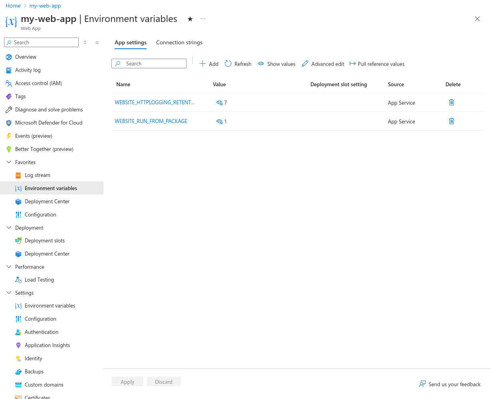

After you make your changes, click Apply. The changes will take effect in about 5 minutes after your app restarts.

## Appendix: Viewing Logs

You can choose to save your app's logs to view them later.

Find your Web App in the Azure portal and select the "App Service Logs" blade.

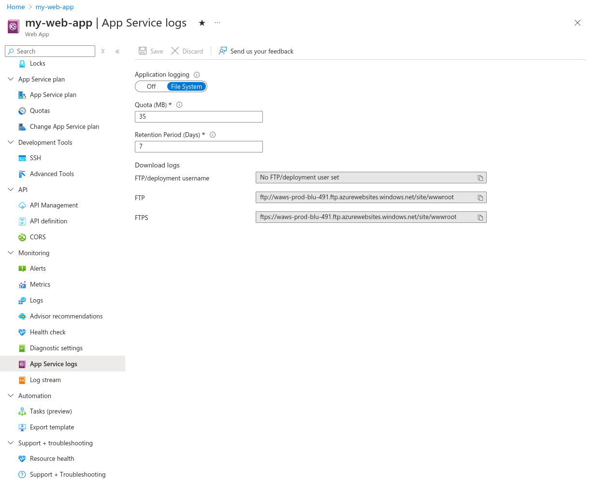

1. Set Application Logging to "File System"
2. Add a maximum log size (between 25MB and 100MB)
3. Add a log retention period. Old logs will be deleted after this amount of days.

The changes should save automatically.

Then, find the "Log stream" blade. **From here, you can see new logs as they come in.**

If you are looking for older logs, find the "Advanced tools" blade:

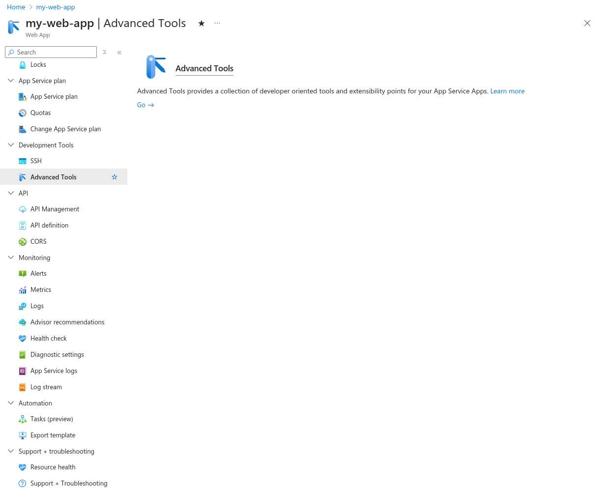

Click "Go". You should be taken to a page that looks like this:

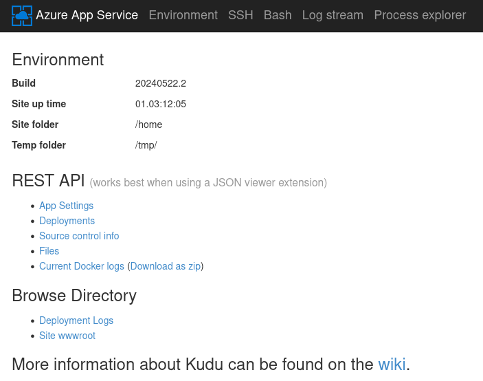

<small>

This page is provided by the Kudu service. Learn more at the App Service [documentation](https://learn.microsoft.com/en-us/azure/app-service/resources-kudu) or the [project's wiki](https://github.com/projectkudu/kudu/wiki).

</small>

From here, click on "Current Docker logs". This will open up a JSON file of your app's current and past log files.

- Files ending in `_default_docker.log` contain your app's logs
- Files ending in `_docker.log` contain Docker-related App Service logs (App Service runs your app in a Docker container, so these logs contain information about starting and stopping containers, pulling images, etc.)
- Files ending in `_scm_docker.log` contain App Service deployment logs

You can also click "Download as zip" to download every log files on your Web App instance.

Learn more about App Service logs in their [official documentation](https://learn.microsoft.com/en-us/azure/app-service/troubleshoot-diagnostic-logs).
