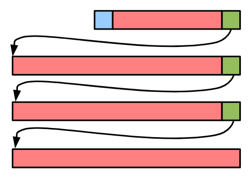

**SQLite is my favorite database.** It's so simple, so fast, and it can take you so far building a small/medium-scale service.

A few days ago, I was lucky enough to stumble upon a [lecture](https://www.youtube.com/watch?v=ZSKLA81tBis) from Dr. Richard Hipp, the creator of SQLite, in my YouTube recommandations. Here are a few of the many things I learned from that lecture and my subsequent browsing of the official documentation and listening to two [podcast](https://changelog.com/podcast/201) [appearances](https://changelog.com/podcast/454).

We're going to start with some larger concepts and end with some bite-sized fun facts.

## The SQLite Stack

SQLite can be broken into 6 subsystems, where each subsystem knows nothing about the implementation details of the others.
This allows users to swap parts of the system for their own; for example, Bloomberg uses SQLite's frontend (top 3 layers) with a custom storage engine (bottom 3 layers) in its [Comdb2 project](https://bloomberg.github.io/comdb2/overview_home.html).

<figure>


<figcaption>

[Source](https://sqlite.org/talks/howitworks-20240624.pdf) (page 19)

</figcaption>

</figure>

| System          | What it does                                                                             |
| --------------- | ---------------------------------------------------------------------------------------- |
| Parser          | Converts a query string to an abstract syntax tree                                       |
| Code Generator  | Generates a program that will perform the query in the form of bytecode                  |
| Virtual Machine | Interprets the generated bytecode                                                        |
| B-tree          | Stores and locates B-tree nodes on disk                                                  |
| Pager           | Handles transactions, disk caching, and concurrency                                      |
| OS Interface    | Provides OS-specific filesystem access and locking ([docs](https://sqlite.org/vfs.html)) |

We're going to start with the B-tree and Pager layers and then work our way up.

## How SQLite represents databases

SQLite databases are structured as B-trees.

- Each branch ("interior") node contains integer keys and pointers to other nodes.
- The leaf nodes contain "cells", which are composed of a key and some arbitrary data associated with a table row.
  In the diagram below, a cell is a combination of one blue square and one red rectangle.

There are two distinct types of B-trees that can appear in a SQLite file: table and index.

- Tables use B+ trees, which are a special type of B-tree where data is only stored in leaf nodes. Those leaf nodes store:
  1. 64-bit integer keys, which include the row's `ROWID` and/or primary keys
  2. Arbitrary blob content, which includes all of the row's other values
- Indexes use standard B-trees. Each branch/interior node includes keys and pointers to other nodes, and each leaf node just contains a key.
  - The key is an arbitrary blob that includes all the data (i.e. row values) the index needs to remain sorted AND the value(s) of the row's primary key(s) (to look up the row in the table after it's found in the index).
  - Index B-trees hold no arbitrary blob content after the key, which makes them different from table B-trees.
- This distinction is made because table rows should only be clustered by their `ROWID`, so that's the only part that comprises the key. With indexes, they need to be sorted on every column that comprises them, so they're all included in the key.

The [header file](https://github.com/sqlite/sqlite/blob/master/src/btreeInt.h) for SQLite's in-memory B-tree implementation has some really great documentation on how this works.

<figure>


<figcaption>

[Source](https://sqlite.org/talks/howitworks-20240624.pdf) (page 65)

</figcaption>

</figure>

### Okay, but why is this cool?

Using a B-tree allows SQLite to look up your data really fast, even in extremely large tables.
Looking up a row by its `ROWID` or other indexed values is a binary search, so it has a time complexity of `O(log(N))`, where `N` is the number of rows in the table or index &mdash; so, as your table grows, as long as you have proper indexes, your queries don't dramatically slow down. Neat!

### It's trees all the way down (all the way up?)

SQLite knows where all the tables are on disk because their root page numbers are stored as values in the `sqlite_schema` table &mdash; which is a B-tree that always starts on page 1.

In this table, you can also find the `CREATE TABLE` statements you used to create every table in your database.
You can try this right now! Open up `sqlite` in your terminal.

```
❯ sqlite3
SQLite version 3.46.1 2024-08-13 09:16:08
Enter ".help" for usage hints.
Connected to a transient in-memory database.
Use ".open FILENAME" to reopen on a persistent database.
sqlite> CREATE TABLE test(a, b);
sqlite> .mode box
sqlite> select * from sqlite_schema;
┌───────┬──────┬──────────┬──────────┬─────────────────────────┐
│ type  │ name │ tbl_name │ rootpage │           sql           │
├───────┼──────┼──────────┼──────────┼─────────────────────────┤
│ table │ test │ test     │ 2        │ CREATE TABLE test(a, b) │
└───────┴──────┴──────────┴──────────┴─────────────────────────┘
```

The `sqlite_schema` table occupies page 1, so the new table we create starts on page 2.
You can actually calculate where this is in the file by multiplying the page number by the page size. Keep in mind that page numbers start at 1, so page 1 is at the beginning of the file.

Assuming we're using the default page size of 4096 bytes, we could read the root page of the `test` table by seeking to 4096 \* (2 - 1) = **4096** bytes and read the next **4096** bytes.

### The tuple format

The leaves on a table B-tree contain rows' primary keys, which are always 64-bit integers, as well as some arbitrary blob data.
This arbitrary blob data is stored using SQLite's tuple format.


The types are constants that represent how SQLite should interpret the data:

| Type           | Meaning        | Data Length (bytes) |
| -------------- | -------------- | ------------------- |
| 0              | NULL           | 0                   |
| 1              | signed integer | 1                   |
| 2              | signed integer | 2                   |
| 3              | signed integer | 3                   |
| 4              | signed integer | 4                   |
| 5              | signed integer | 6                   |
| 6              | signed integer | 8                   |
| 7              | IEEE float     | 8                   |
| 8              | integer zero   | 0                   |
| 9              | integer one    | 0                   |
| 10,11          | not used       |                     |
| N>=12 and even | BLOB           | (N-12)/2            |
| N>=13 and odd  | string         | (N-13)/2            |

It's interesting to me that there are constants for the integers 0 and 1 to save storage since they are the most common integers.

Also, in the tuple format and in many other places in the file format, SQLite uses variable-length integers, so smaller integers take up less storage space. [Here's some more information](https://www.sqlite.org/fileformat2.html#varint) about SQLite's current VarInt format, and [here's a scrapped proposal](https://sqlite.org/src4/doc/trunk/www/varint.wiki) to rework the VarInts to be more space efficient. I also found [a great YouTube video](https://www.youtube.com/watch?v=7MpsHqCQcUg) explaining how to decode SQLite VarInts.

Fun fact: since SQLite is a row store, the file format technically allows for different rows in the same table to have different numbers of columns.

### Overflow

If a row's content exceeds the size of the page it's on, it's stored as a linked list.
Even though this may seem slow, reading many blobs via SQLite is still faster than the file system for blobs up to about 100 KB due to the overhead of calling `fopen`.



### Going Deeper

If you want to learn more, check out SQLite's [file format docs](https://www.sqlite.org/fileformat.html).

## How queries are run

Remember the SQLite Stack diagram from earlier in the article? This section will cover the Parser, Code Generator, and Virtual Machine.

When you query your SQLite database, the query string is converted into bytecode and then run on a register-based virtual machine.
It's not just a query, it's a _program_.
Here's a quote from [a really old tech talk at Google](https://youtu.be/f428dSRkTs4?t=1453) that I liked:

> "You really need to think of SQLite as a peculiar programming language [...] Instead of specifying the algorithm that you're going to use to do something, you specify what you want the end result to be and then let the database engine figure out the algorithm for you."

Fun fact about the parser: if it sees a keyword where an identifier should be, it'll allow the token to be used as an identifier (as long as it doesn't create parsing ambiguity). This is why you can write statements like this:

```sql
CREATE TABLE BEGIN(REPLACE, PRAGMA, END);
```

Anyways, the Parser converts your query to an abstract syntax tree (AST). Then, the Code Generator looks at your AST and converts it into some bytecode that defines the way SQLite will run your query at a low level.
We can see this bytecode by adding `EXPLAIN` at the beginning of a query.

```sql
SQLite version 3.46.1 2024-08-13 09:16:08
Enter ".help" for usage hints.
Connected to a transient in-memory database.
Use ".open FILENAME" to reopen on a persistent database.
sqlite> .mode box
sqlite> CREATE TABLE t1(a, b, c);
sqlite> EXPLAIN SELECT * FROM t1 WHERE a = :a;
addr  opcode         p1    p2    p3    p4             p5  comment
----  -------------  ----  ----  ----  -------------  --  -------------
0     Init           0     11    0                    0   Start at 11
1     OpenRead       0     2     0     3              0   root=2 iDb=0; t1
2     Rewind         0     10    0                    0
3       Column         0     0     1                    0   r[1]= cursor 0 column 0
4       Ne             2     9     1     BINARY-8       81  if r[1]!=r[2] goto 9
5       Column         0     0     3                    0   r[3]= cursor 0 column 0
6       Column         0     1     4                    0   r[4]= cursor 0 column 1
7       Column         0     2     5                    0   r[5]= cursor 0 column 2
8       ResultRow      3     3     0                    0   output=r[3..5]
9     Next           0     3     0                    1
10    Halt           0     0     0                    0
11    Transaction    0     0     1     0              1   usesStmtJournal=0
12    Variable       1     2     0                    0   r[2]=parameter(1)
13    Goto           0     1     0                    0
```

Let's take a closer look at this:

| Address | What it does                                                                                                     |
| ------- | ---------------------------------------------------------------------------------------------------------------- |
| 1       | Opens a cursor to read from the table, starting at the table's root page (2)                                     |
| 2, 9    | Encloses a loop that iterates over the rows in the table                                                         |
| 4       | Compares the value of `a` to the parameter and jumps to address 9 (restarts the loop) if the values aren't equal |
| 5-7     | Adds columns `a`, `b`, and `c` to the result row                                                                 |
| 8       | Outputs a result row                                                                                             |

Because we haven't added any indexes, this query requires a full table scan.

When execution reaches instruction #8 (ResultRow), **the virtual machine pauses** until our application needs another row. This allows us to wait to request more rows until we need them.

If we add an index, the query plan looks like this:

```sql
sqlite> CREATE INDEX i1 ON t1(a);
sqlite> EXPLAIN SELECT * FROM t1 WHERE a = :a;
addr  opcode         p1    p2    p3    p4             p5  comment
----  -------------  ----  ----  ----  -------------  --  -------------
0     Init           0     14    0                    0   Start at 14
1     OpenRead       0     2     0     3              0   root=2 iDb=0; t1
2     OpenRead       1     3     0     k(2,,)         2   root=3 iDb=0; i1
3     Variable       1     1     0                    0   r[1]=parameter(1)
4     IsNull         1     13    0                    0   if r[1]==NULL goto 13
5     SeekGE         1     13    1     1              0   key=r[1]
6       IdxGT          1     13    1     1              0   key=r[1]
7       DeferredSeek   1     0     0                    0   Move 0 to 1.rowid if needed
8       Column         1     0     2                    0   r[2]= cursor 1 column 0
9       Column         0     1     3                    0   r[3]= cursor 0 column 1
10      Column         0     2     4                    0   r[4]= cursor 0 column 2
11      ResultRow      2     3     0                    0   output=r[2..4]
12    Next           1     6     1                    0
13    Halt           0     0     0                    0
14    Transaction    0     0     2     0              1   usesStmtJournal=0
15    Goto           0     1     0                    0
```

This program uses the index (shown by the `SeekGE` and `IdxGT` instructions) to find the value with a time complexity of `O(log(n))`, so it'll be much faster than the previous query, especially when the table contains a lot of rows.

| Address | What is does                                                                                    |
| ------- | ----------------------------------------------------------------------------------------------- |
| 1       | Opens a cursor to read data from the table, `t1`                                                |
| 2       | Opens a cursor to read data from the index, `i1`                                                |
| 5       | Finds the first key in the index which is greater than or equal to the parameter's value (`:a`) |
| 6       | If the index key is greater than the parameter's value (`:a`), jump to instruction 13           |
| 7       | Move the table cursor (cursor 0) to the same row as the index cursor (cursor 1)                 |
| 8-10    | Adds columns `a`, `b`, and `c` to the result row                                                |
| 11      | Output a result row                                                                             |

If we only needed the value of column `a`, SQLite wouldn't need to open up a cursor for the table because the value of `a` is available from the index. This is called a [covering index](https://www.sqlite.org/queryplanner.html#covidx).

```sql
sqlite> EXPLAIN SELECT a FROM t1 WHERE a = :a;
addr  opcode         p1    p2    p3    p4             p5  comment
----  -------------  ----  ----  ----  -------------  --  -------------
0     Init           0     10    0                    0   Start at 10
1     OpenRead       1     3     0     k(2,,)         2   root=3 iDb=0; i1
2     Variable       1     1     0                    0   r[1]=parameter(1)
3     IsNull         1     9     0                    0   if r[1]==NULL goto 9
4     SeekGE         1     9     1     1              0   key=r[1]
5       IdxGT          1     9     1     1              0   key=r[1]
6       Column         1     0     2                    0   r[2]= cursor 1 column 0
7       ResultRow      2     1     0                    0   output=r[2]
8     Next           1     5     1                    0
9     Halt           0     0     0                    0
10    Transaction    0     0     2     0              1   usesStmtJournal=0
11    Goto           0     1     0                    0
```

If you want to learn more, the SQLite documentation includes a list of opcodes [here](https://sqlite.org/opcode.html).

## How SQLite transactions are atomic

This section covers the Pager layer from the SQLite Stack diagram at the beginning of the article.

Maybe you've seen a statement like this before:

```sql
PRAGMA journal_mode = WAL;
```

This pragma allows you to change SQLite's **journal mode**, which is how it achieves atomic commit and rollback operations.
The two most commonly-used journal modes are **rollback** and **write-ahead log (WAL)**. Let's see how they work.

### Rollback

The default journal mode is rollback. You can activate it with the following pragma:

```sql
PRAGMA journal_mode = DELETE;
```

In a transaction, right before writing new pages to the disk, the old pages are copied into a separate file alongside your database file named `*-journal`, where `*` is the name of your database. Then, the changed pages are written from memory to the database file. If this operation fails, the changed pages in the database file could be corrupted.

However, the previous versions of the pages are still present in the journal file. When a new connection is opened, SQLite sees the journal file and (if some [criteria](https://www.sqlite.org/atomiccommit.html#_hot_rollback_journals) are met) attempts to copy the old versions of the pages into the database file, rolling back the failed transaction.

Even if this rollback operation fails, the data is still safe in the journal file, so it can be attempted as many times as necessary to undo the failed transaction. When all of the old pages have been successfully copied into the database file, the journal file is deleted, which is [considered](https://www.sqlite.org/atomiccommit.html#:~:text=Deleting%20a%20file%20is%20not%20really%20an%20atomic%20operation,%20but%20it%20appears%20to%20be%20from%20the%20point%20of%20view%20of%20a%20user%20process) an atomic operation even though it may not be.

#### Concurrency in rollback mode

The rollback journal supports multiple concurrent readers OR one concurrent writer at any given time.

Readers acquire a Shared lock, which guarantees that there are no ongoing writes to the database file. The Shared lock can be acquired by multiple concurrent readers. When they're done reading, the Shared lock is released.

Writers first obtain a Reserved lock. Only one Reserved lock may be active at a time, and while the Reserved lock is held, new Shared locks can still be acquired. With this lock, the writer writes a journal file with the previous contents of the pages that are to be updated. Then, the writer acquires an Exclusive lock, which prevents any other concurrent reads or writes. This may require waiting for other readers to finish. Once the Exclusive lock is acquired, the changed pages are written and flushed to disk, the journal file is deleted, and the Exclusive lock is released.

Learn more about the types of locks [here](https://www.sqlite.org/lockingv3.html#locking) or about how rollback-mode writes are performed [here](https://www.sqlite.org/lockingv3.html#writing).

### Write-Ahead Logging (WAL)

When a transaction commits, WAL mode appends all updated pages to a log file. Then, when the log file reaches a total of 1000 changed pages, the database file is updated with the new content during an operation known as a **checkpoint**. When readers look for a page on disk, they check the log file first to make sure they're reading the most up-to-date content.

In WAL mode, multiple readers AND a single writer can access the database concurrently, and most write transactions are much faster because they require fewer disk writes and `fsync` calls. For these reasons (and [a few others](https://www.sqlite.org/wal.html#overview)), you should prefer WAL mode in most scenarios.

One exception to this is on network filesystems. SQLite in WAL mode uses `mmap` to create some shared memory in a [`*-shm`](https://www.sqlite.org/walformat.html#shm) file alongside your database file. However, shared memory only works when clients are on the same host device, so WAL mode wouldn't work properly unless you [disable shared memory](https://www.sqlite.org/wal.html#noshm).

Note that the lack of simultaneous writers usually isn't an issue for most users. If you're running a client-server database like MySQL or Postgres on one node, then you likely still lack simultaneous writers because your filesystem or disks may only be able to handle one concurrent writer. The bottleneck is just at the OS/hardware level, while SQLite enforces it in userspace.

You can enable WAL mode with the following pragma:

```sql
PRAGMA journal_mode = WAL;
```

#### Important things to know about WAL mode

- A long-running read transaction delays checkpointing of any pages written after the transaction was started until the transaction ends.
- As the size of the WAL file increases, reads slow down. This is why it's important to allow for some periods with no reads so that checkpointing can complete.
- A read operation cannot see any of the pages appended to the WAL after it started.
- Write transactions will be very fast until the WAL file reaches its threshold. Then, due to checkpointing, there will be one very slow commit.

## Rapid fire: some other things you may want to know

### Why does SQLite have so few contributors?

The SQLite source code has been released into the public domain. This is a complicated legal process, especially in Europe, which is why there are only a few contributors. The project's website [says](https://sqlite.org/copyright.html):

> In order to keep SQLite completely free and unencumbered by copyright, the project does not accept patches. If you would like to suggest a change and you include a patch as a proof-of-concept, that would be great. However, please do not be offended if we rewrite your patch from scratch.

### How do you pronounce SQLite?

Dr. Richard Hipp, the creator of SQLite, pronounces it "S-Q-L-ite", like a mineral. He also pronounces Gigabyte as "Jigabyte".

However, [he says](https://youtu.be/KgcqPYahSQg?t=165) there's no correct pronounciation, so say it the way your heart desires. I think I'll stick to "sequel-lite" for now.

### The maximum size of SQLite database files

SQLite [lists](https://www.sqlite.org/limits.html#max_page_count) its maximum size limit as 256 TiB; however, that figures assumes that you are using a page size of 65,536 bytes. With the default page size of 4096 bytes, your database can reach up to 16 TiB, which probably still is much more than you'll ever need. If you need to go beyond the database file size limit, you could split your data among multiple database files and `ATTACH` them to utilize up to 11x more data (only 10 databases can be attached at once).

### How SQLite is distributed

Most end users install a prebuilt SQLite binary, but you can also download the entirety of SQLite in one C file.
It's called the [amalgamation](https://sqlite.org/amalgamation.html), and it currently weighs about 9 MB and has about 163,000 SLOC.

### Drawbacks of paging

The minimum unit of I/O in SQLite is a **page**, and the default page size of 4096 bytes.

When a row is updated in SQLite, _the entire page_ must be written to disk. Depending on your page size or how rows are clustered, this could be a lot of extra writes!

## Conclusion & Learning Resources

Diving a bit deeper into the internals of software you use is a great way to improve the software you build with it.
For me, this exploration was also a great introduction to B-trees, and I learned a ton about binary storage formats, ACID, and how database indexes work.
I hope you learned something new too :)

Here are the resources I used to prepare this article. I recommend you use these to continue exploring the topics you found interesting.

- Lecture from July 2024 at Saarland University: https://www.youtube.com/watch?v=ZSKLA81tBis
  - This was my favorite resource and the reason why I wrote this post. It's a goldmine, and it contains references that allow you to go deeper and learn more about specific topics.
  - Slides: https://sqlite.org/talks/howitworks-20240624.pdf
- A tech talk from May 2006 at Google: https://www.youtube.com/watch?v=f428dSRkTs4
  - This is a good overview of SQLite and why and how you may want to use it. A few details have changed since this talk, like the lack of foreign key support and the implementation details of the virtual machine, but most of the information is still relevant.
- 1st Interview with The Changelog: https://changelog.com/podcast/201
  - This podcast is about SQLite's initial development and why it is so popular today.
- 2nd Interview with The Changelog: https://changelog.com/podcast/454
  - This podcast is mainly about Dr. Richard Hipp's other projects, like Fossil (version control system) and Althttpd (a lightweight web server).
- The official SQLite documentation: https://www.sqlite.org/docs.html
