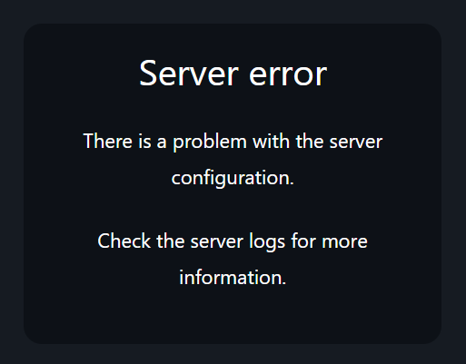

> ⚠️ Auth.js v5 is still in beta, so the APIs covered in this article are subject to change.

**Note**: The Next.js package for Auth.js is still called NextAuth. The code examples in this article use NextAuth, but my solution will likely work on [other frameworks](https://authjs.dev/getting-started/integrations) that Auth.js supports, like SvelteKit, SolidStart, and Qwik.

---

## Background

Recently, I was building a Next.js app with [NextAuth](https://authjs.dev/). I had to add an OAuth provider with an additional authorization check. However, if the authorization check failed, I found that the client received this obscure error message:



This is hardly user-friendly, so I tried to throw a custom error in my authorization handler:

```ts {18, 25, 30-35} title="src/auth.ts"
import { type JWT } from "@auth/core/jwt";
import NextAuth, { type User } from "next-auth";
import Google from "next-auth/providers/google";
import { getUserInfo } from "some/example/library";

export const { auth, handlers, signIn, signOut } = NextAuth({
  providers: [Google()],
  callbacks: {
    async session({ session, token }) {
      if (token.user) {
        // Pass the `user` field from the user's JWT to their session,
        // allowing us to access it with the `auth()` function or via `useSession()` on the client.
        session.user = token.user;
      }

      return session;
    },
    async jwt({ token, account }) {
      if (account) {
        // `account` is only present on the initial login.
        try {
          // Fetch some data from an external service that should be attached to the user's JWT.
          // Don't do this with data that you expect to change while the user is signed in!
          // You will have to re-issue a new JWT every time it changes.
          const userProfile = await getUserInfo();
          return {
            ...token,
            user: userProfile, // Add the info to the user's token
          } satisfies JWT;
        } catch (error) {
          // Rethrow with a user-friendly error message
          throw new Error(
            "We couldn't find your profile. Please contact us if the error persists."
          );
        }
      }
    },
  },
});

declare module "@auth/core/types" {
  interface User {
    // Augment the User interface with some custom data
    userInfo?: any;
  }
}

declare module "@auth/core/jwt" {
  interface JWT {
    // Add a user field to the JWT so that the information can be transferred to the session
    user: User;
  }
}
```

However, my new error message wasn't being displayed.
I did some research and came across [this GitHub issue](https://github.com/nextauthjs/next-auth/issues/9099)
about passing errors to the client from a credential provider's `authorize` handler.

The only difference between their situation and mine was that I was using a `jwt` handler on the user's first login
instead of implementing my logic with a credentials provider, and
[the issue's proposed solution](https://github.com/nextauthjs/next-auth/issues/9099#issuecomment-1913754338) and
[its eventual implementation](https://github.com/nextauthjs/next-auth/pull/9871) didn't support that use case.

## The Solution

**Note**: If you are using a credentials provider and your error-prone logic is in the `authorize` callback, see [this pull request](https://github.com/nextauthjs/next-auth/pull/9871) for a built-in solution.

My idea was to add a field on the token when an error occurs that can be checked in middleware or on the client.
**Here's how you can replicate this in your own app.**

First, if you're using TypeScript, augment the JWT and Session interfaces:

```ts title="src/auth.ts"
// This can be anything, just make sure the same type
// is used in both the JWT and Session interfaces.
type CustomAuthError = string;

declare module "@auth/core/types" {
  interface User {
    // Augment the User interface with some custom data
    userInfo?: any;
  }
}

declare module "@auth/core/jwt" {
  interface JWT {
    user: User;
    error?: CustomAuthError;
  }
}

declare module "next-auth" {
  interface Session {
    error?: CustomAuthError;
  }
}
```

### Passing The Error to The Client

Then, in your `jwt` callback, set an `error` property on the user's token when an exception is thrown:

```ts {3, 10, 12, 18} title="src/auth.ts"
// This function should be in the `callbacks` object in your Auth.js config.
async function jwt({ token, account }) {
  let error: CustomAuthError | undefined;
  try {
    // Some code that could throw an error
    const userInfo = await getUserInfo();
  } catch (e) {
    // For example:
    if ("status" in e && e.status === 401) {
      error = "You are not allowed to access this application.";
    } else {
      error = "There was a problem signing you in.";
    }
  }

  return {
    ...token,
    error,
  } satisfies JWT;
}
```

Finally, in your `session` callback, pass the property from the user's token to their session:

```ts {7-9} title="src/auth.ts"
// This function should be in the `callbacks` object in your Auth.js config.
async function session({ session, token }) {
  if (token.user) {
    session.user = token.user as User;
  }

  if (token.error) {
    session.error = token.error;
  }

  return session;
}
```

> **Note**: The rest of this guide is Next.js-specific, but the concepts are very similar in the other frameworks that Auth.js supports.

### Retrieving and Displaying The Error (Next.js-specific)

Now, you can access the error from the client or in middleware. Here's a Next.js middleware example:

```ts title="src/middleware.ts"
import { auth } from "./auth.ts";

export const middleware = auth(async (req) => {
  // `req.auth` is populate with the user's session when using
  // the NextAuth middleware wrapper
  if (req.auth?.error && req.nextUrl.pathname !== "/auth/error") {
    // Redirect to a custom error page.
    const newURL = req.nextUrl.clone();
    newURL.pathname = "/auth/error";
    // For example, you can use the error as a URL parameter:
    newURL.searchParams.set("code", req.auth?.error);
    return NextResponse.redirect(newURL);
  }
});

export const config = {
  // Side note: you can save middleware invocations by configuring it to not run on static files and API routes.
  // See https://nextjs.org/docs/app/building-your-application/routing/middleware#matcher
  matcher: ["/((?!api|_next/static|_next/image|favicon.ico).*)"],
};
```

Learn more about Auth.js middleware for Next.js [in their official docs](https://authjs.dev/getting-started/session-management/protecting#nextjs-middleware).

**⚠️ If you create a custom error page as shown in the middleware example, make sure to sign the user out when they visit it!**
Otherwise, you may accidentally create an infinite loop that prevents the user from making another sign-in attempt.

If you want to access it on the client, you can write a component like this:

```ts title="components/SessionErrorHandler.ts"
"use client";

import { signIn, useSession } from "next-auth/react";
import { useEffect } from "react";

export const SessionErrorHandler = () => {
  const { data: session } = useSession();

  useEffect(() => {
    if (session?.error) {
      // If an error is present, do something with it.
      // For example, you can display it to the user...
      alert(session?.error);
      // ...or immediately redirect them to your sign in page.
      signIn();
    }
  }, [session]);

  return null;
};
```

You can use this as a normal React component in your root layout:

```tsx title="app/layout.tsx"
import { type ReactNode } from "react";
import { SessionErrorHandler } from "../components/SessionErrorHandler";

export default async function RootLayout({
  children,
}: {
  children: ReactNode;
}) {
  return (
    <html>
      <SessionErrorHandler />
      <body>{children}</body>
    </html>
  );
}
```

---

## Final Note

After writing this, I realized the NextAuth developers used the same pattern in their documentation!
In the section about [handling Google refresh tokens](https://authjs.dev/guides/refresh-token-rotation#jwt-strategy),
if there was an error refreshing the user's access token, the `jwt` callback sets an error on the user's token,
which is passed to the user's session. When the client sees a session with a `RefreshAccessTokenError`, it
signs the user out.
