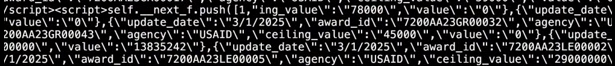
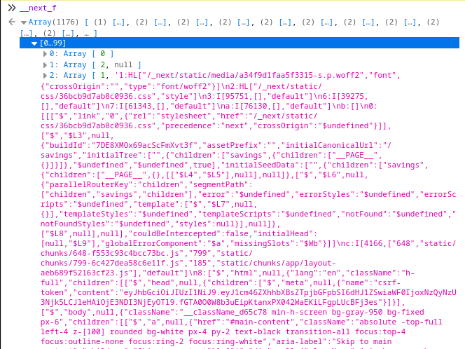

I recently saw [a video](https://www.nytimes.com/video/us/politics/100000010047426/elon-musks-team-is-less-transparent-and-still-making-big-errors.html) from the New York Times looking into the savings that DOGE claimed it made by terminating federal grants. In the video, they mentioned that DOGE removed the Grant IDs from their website, which made it much more difficult for them to investigate&mdash;but for a few days, they left them in the page's source code.

They showed this image on screen:


Since I already knew the website was built with Next.js, the escaped JSON immediately made me think this was a RSC (React Server Components) payload.
A closer look confirmed this; you can see the image includes `<script>` tags that begin with `self.__next_f.push(...)`:



Next.js generates these script tags when it needs to pass information to Client Components during hydration.

## Hydration

Next.js is a full-stack React framework. It renders pages on the server before sending them to users, which can make your site's [First Contentful Paint](https://web.dev/articles/fcp) much faster because the browser doesn't have to download, parse, and execute JavaScript to show the page's initial content.

However, this prerendered page is non-interactive. For user interactions to work, the browser has to download a JavaScript bundle containing your Client Component implementations and React itself. Then, a Next.js bootstrap script calls `react-dom`'s [`hydrateRoot`](https://react.dev/reference/react-dom/client/hydrateRoot#hydrateroot) function, which re-renders your Client Components in the user's browser, traverses the DOM, and mounts those components on their existing DOM nodes.

For this to happen, React needs to know the values of the props that your Client Components used on the server&mdash;so Next.js includes them in a set of `<script>` tags at the bottom of the `<body>`.

<figure>



<figcaption>

The value of `__next_f` on doge.gov

</figcaption>
</figure>

The key point to remember here is that the entirety of your Client Components' props is included in the generated HTML. **If a Client Component receives a value as a prop and doesn't use it, it's still sent to the client.**

> Read more about RSC payloads [in the Next.js docs](https://nextjs.org/docs/app/building-your-application/rendering/server-components#what-is-the-react-server-component-payload-rsc).

## How to Avoid This

### Use Server Components

When Next.js renders a Server Component, it only needs to pass a JSONified copy of the DOM tree in the RSC payload. Any unused data received as props in a Server Component isn't passed to the client.

### The `taint` API

If you want to proactively prevent an object from being passed to the client, you can mark it with React's [`taintObjectReference`](https://react.dev/reference/react/experimental_taintObjectReference) and [`taintUniqueValue`](https://react.dev/reference/react/experimental_taintUniqueValue) APIs.

`taintObjectReference` prevents the object passed as its first parameter from making it into a Client Component, which means its values are guaranteed to not be accidentally leaked to the end user. `taintUniqueValue` does the same, but with values like API tokens or environment variables.

```tsx
import { experimental_taintObjectReference as taintObjectReference } from "react";

taintObjectReference(
  "Do not pass ALL environment variables to the client.",
  process.env
);

// Now, using `process.env` as a prop in a Client Component will throw an error.
```

This shouldn't be your only line of defense, but it's another tool that you can use to protect sensitive information.

Note that `taintObjectReference` works by **reference**, not by value. If you copy the tainted object, it can be passed to Client Components without throwing an error.

## Manually pass individual props instead of fully objects

The simplest solution: only pass the values you need to your Client Components. Instead of this,

```tsx
const user = await fetchUser(userId);

return <UserProfileCard user={user} />;
```

Do this instead:

```tsx
const user = await fetchUser(userId);

return <UserProfileCard id={user.id} name={user.name} photo={user.photo} />;
```

Becaues you're only including the fields you need, this also comes with the benefit of making your RSC payloads smaller, which reduces bandwidth usage and makes your [Time to Interactive](https://web.dev/articles/tti) a bit faster.

### DTOs

DTO stands for **data transfer object**. It's an intermediate object that holds data that the UI layer is allowed to see.

When data is returned from the database layer, it may include sensitive information.
Before passing the data to the UI, a new object (a DTO) is created and populated with only the necessary fields.
This is similar to the previous method, but it's a bit farther removed from your UI layer, so it's easier to enforce.

Check out [this guide from the Next.js Docs](https://nextjs.org/docs/app/building-your-application/authentication#using-data-transfer-objects-dto) for more information.

## Conclusion

Web frameworks aren't magic. When you need to separate public and sensitive information, make sure your Client Components don't receive anything you don't intend to display to your users. To reduce the likelihood of accidentally leaking sensitive information, split up objects into their constituent fields before passing their information as props, or remove sensitive fields from your objects before passing them to your UI layer.

This is a very easy mistake to make, so **be careful**!
