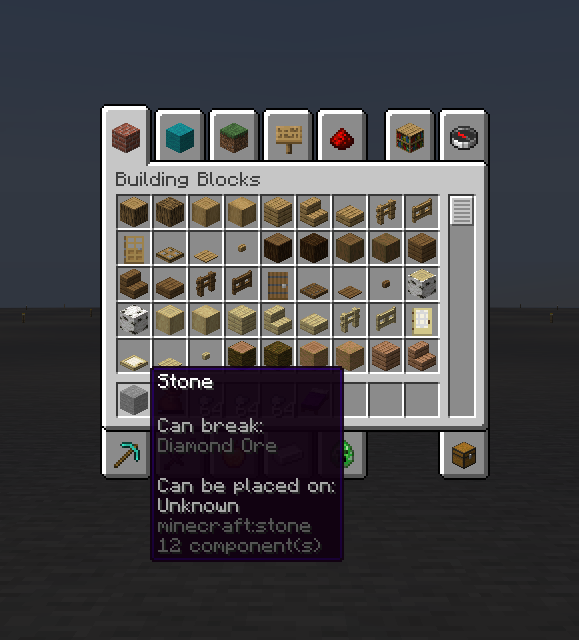
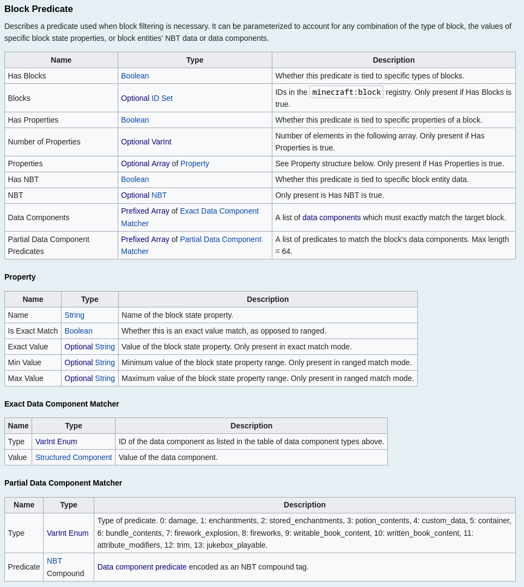

> Note: When I mention Minecraft source code in this blog post, I'm using Fabric with Yarn mappings on Minecraft 1.21.5. Your method and variables names and line numbers may not match if you don't use the same version and mappings.

## Context

In my free time, I work on a Minecraft server called [BlueDragon](https://bluedragonmc.com/) that uses [Minestom](https://minestom.net/), a Minecraft server implementation built from the ground up without any Mojang code.

For a while, I've wanted to contribute more upstream, so I decided I would tackle [this issue](https://github.com/Minestom/Minestom/pull/2699#issuecomment-2848516382) which caused players to disconnect when receiving a [Set Player Inventory Slot Packet](https://minecraft.wiki/w/Java_Edition_protocol/Packets#Set_Player_Inventory_Slot) that contained the "Can Place On" and/or "Can Break" information used in Adventure Mode.

In Minecraft 1.21.5, [a new field was added](https://www.minecraft.net/en-us/article/minecraft-snapshot-25w10a#:~:text=Block%20Predicates,partial%20contents%20of%20block%20entity%20components) to block predicates allowing you to filter by a block entity's [data components](https://minecraft.wiki/w/Data_component_format). This also means the [network format for an inventory slot](https://minecraft.wiki/w/Java_Edition_protocol/Slot_data) had changed, so a valid window slot packet from before 1.21.5 would be invalid on the new version.

I thought it would be an easy fix: just check the new [protocol format on the Minecraft Wiki](https://minecraft.wiki/w/Java_Edition_protocol/Packets), update Minestom's packet reading and writing to match, and everything would work! However, it ended up being a much larger change than I expected, and on the way, I learned a ton about Minecraft's packet writing, registries, and codec system.

## Diagnosing the Network Protocol Error

Here is the reproduction that [@EclipsedMango provided](https://github.com/Minestom/Minestom/pull/2699#issuecomment-2848516382):

```java
public static final ItemStack MULTITOOL = createItem(Material.TRIPWIRE_HOOK, Component.text("Multitool").color(NamedTextColor.WHITE))
            .set(DataComponents.CAN_BREAK, new BlockPredicates(new BlockPredicate(Block.OAK_PLANKS, Block.STONE, Block.WHEAT)))
            .build().withTag(ITEM_SAVE_ID, 1);
```

When giving players an item with the `CAN_PLACE_ON` or `CAN_BREAK` data components, the player is disconnected with the following exception:

```
io.netty.handler.codec.DecoderException: Failed to decode packet 'clientbound/minecraft:set_player_inventory'
```

This means our server isn't writing the packet correctly. Looking further at the stack trace reveals...nothing, because Minecraft is obfuscated:

```java
Caused by: io.netty.handler.codec.DecoderException: Expected non-null compound tag
  at knot//net.minecraft.class_9135$7.method_68119(class_9135.java:244)
  at knot//net.minecraft.class_9135$7.decode(class_9135.java:239)
  at knot//net.minecraft.class_9135$8.method_68123(class_9135.java:305)
  at knot//net.minecraft.class_9135$8.decode(class_9135.java:302)
  at knot//net.minecraft.class_9336$1.method_57949(class_9336.java:20)
  at knot//net.minecraft.class_9336$1.method_57948(class_9336.java:16)
  at knot//net.minecraft.class_9336$1.decode(class_9336.java:12)
  at knot//net.minecraft.class_9135$15.method_56417(class_9135.java:415)
  at knot//net.minecraft.class_9135$15.decode(class_9135.java:409)
  at knot//net.minecraft.class_9139$11.decode(class_9139.java:79)
  ...
```

<small>

Note: these are Fabric's [intermediary mappings](https://github.com/FabricMC/intermediary). The game runs with these when you use the Fabric mod loader. A vanilla Minecraft stack trace would look a bit different, but it would be just as useless.

</small>

I set up a Fabric mod using the [official template](https://github.com/FabricMC/fabric-example-mod/tree/1.21) and used the provided `runClient` Gradle task to run Minecraft deobfuscated, which gives us a much more useful stack trace:

```java {6-8,17-20}
Caused by: io.netty.handler.codec.DecoderException: Expected non-null compound tag
  at knot//net.minecraft.network.codec.PacketCodecs$7.decode(PacketCodecs.java:434)
  at knot//net.minecraft.network.codec.PacketCodecs$7.decode(PacketCodecs.java:430)
  at knot//net.minecraft.network.codec.PacketCodecs$8.decode(PacketCodecs.java:499)
  at knot//net.minecraft.network.codec.PacketCodecs$8.decode(PacketCodecs.java:497)
  at knot//net.minecraft.component.Component$1.read(Component.java:18)
  at knot//net.minecraft.component.Component$1.decode(Component.java:14)
  at knot//net.minecraft.component.Component$1.decode(Component.java)
  at knot//net.minecraft.network.codec.PacketCodecs$15.decode(PacketCodecs.java:577)
  at knot//net.minecraft.network.codec.PacketCodecs$15.decode(PacketCodecs.java:571)
  at knot//net.minecraft.network.codec.PacketCodec$11.decode(PacketCodec.java:150)
  at knot//net.minecraft.network.codec.PacketCodec$15.decode(PacketCodec.java:235)
  at knot//net.minecraft.network.codec.PacketCodec$2.decode(PacketCodec.java:298)
  at knot//net.minecraft.network.codec.PacketCodecs$15.decode(PacketCodecs.java:577)
  at knot//net.minecraft.network.codec.PacketCodecs$15.decode(PacketCodecs.java:571)
  at knot//net.minecraft.network.codec.PacketCodec$14.decode(PacketCodec.java:215)
  at knot//net.minecraft.component.ComponentChanges$3.decode(ComponentChanges.java:88)
  at knot//net.minecraft.component.ComponentChanges$3.decode(ComponentChanges.java:76)
  at knot//net.minecraft.item.ItemStack$1.decode(ItemStack.java:241)
  at knot//net.minecraft.item.ItemStack$1.decode(ItemStack.java:234)
  at knot//net.minecraft.network.codec.PacketCodec$15.decode(PacketCodec.java:236)
  at knot//net.minecraft.network.codec.PacketCodec$12.decode(PacketCodec.java:164)
  at knot//net.minecraft.network.codec.PacketCodec$12.decode(PacketCodec.java:161)
  at knot//net.minecraft.network.handler.PacketCodecDispatcher.decode(PacketCodecDispatcher.java:32)
  ... 34 more
```

> ### Side note: Minecraft sources
>
> I don't want to include Minecraft source code in this post as it's copyrighted by Mojang/Microsoft, even though I'm using Yarn mappings instead of the official Mojang ones.
>
> If you want to follow along, clone the [Fabric example mod](https://github.com/FabricMC/fabric-example-mod/tree/1.21) for Minecraft 1.21.5 and run `./gradlew genSources`. If you're using IntelliJ, navigate to a Minecraft class, click "Choose Sources" in the top right, and select the JAR file in `.gradle/loom-cache/minecraftMaven/.../minecraft-merged-...-sources.jar`. You should now be able to see Yarn-mapped Minecraft sources in your editor!
>
> To run the game, use the `runClient` Gradle task (`./gradlew runClient`). If you run it through IntelliJ, you can even attach a debugger to the game.

Let's start from the bottom up:

```java
at knot//net.minecraft.network.handler.PacketCodecDispatcher.decode(PacketCodecDispatcher.java:32)
```

The `decode` method of `PacketCodecDispatcher` reads an integer from a buffer and uses it as the packet ID.
Then, it looks up the packet type from that ID and uses the packet's codec to decode the rest of the buffer.

From this, we know that the error is coming from decoding a packet, which we already knew from the disconnection message. Let's continue:

```java
at knot//net.minecraft.item.ItemStack$1.decode(ItemStack.java:241)
at knot//net.minecraft.item.ItemStack$1.decode(ItemStack.java:234)
```

This tells us that the error comes from decoding some part of an `ItemStack`.

```java
at knot//net.minecraft.component.ComponentChanges$3.decode(ComponentChanges.java:88)
at knot//net.minecraft.component.ComponentChanges$3.decode(ComponentChanges.java:76)
```

As of Minecraft 1.20.5, `ItemStack`s contain data components, which are sent over the network as a map of changes from the item material's "prototype" - the components that it has by default. For example, elytras have the `minecraft:equippable` and `minecraft:glider` components by default, so unless they've been manually changed, the game doesn't need to waste bandwidth transmitting them. That's where the name [`ComponentChanges`]() comes from.

```java
at knot//net.minecraft.component.Component$1.read(Component.java:18)
at knot//net.minecraft.component.Component$1.decode(Component.java:14)
at knot//net.minecraft.component.Component$1.decode(Component.java)
```

The error isn't thrown when decoding the map's structure. Instead, it's from one of the components in the map.

```java
at knot//net.minecraft.network.codec.PacketCodecs$7.decode(PacketCodecs.java:434)
at knot//net.minecraft.network.codec.PacketCodecs$7.decode(PacketCodecs.java:430)
at knot//net.minecraft.network.codec.PacketCodecs$8.decode(PacketCodecs.java:499)
at knot//net.minecraft.network.codec.PacketCodecs$8.decode(PacketCodecs.java:497)
```

[`PacketCodecs`](https://maven.fabricmc.net/docs/yarn-1.21.5+build.1/net/minecraft/network/codec/PacketCodecs.html) is a utility class with codecs for various data types commonly found in packets.
In this case, lines 497 and 499 are related to parsing a registry entry, and they call
lines 430 and 434, which decode an NBT compound.

If the compound is null, it throws a `DecoderException` with the message we saw earlier: `Expected non-null compound tag`.

But this doesn't really make sense. Minecraft 1.21.5 added two **new fields** at the end of the packet, so we shouldn't even be able to read any more data by the time we're parsing them. The error message should say that we're trying to overread the buffer.

I took a look at the example I was using to test:

```java
ItemStack itemStack = ItemStack.builder(Material.STONE)
  .amount(64)
  .set(DataComponents.CAN_PLACE_ON, new BlockPredicates(new BlockPredicate(new BlockTypeFilter.Blocks(Block.STONE), null, null)))
  .set(DataComponents.CAN_BREAK, new BlockPredicates(new BlockPredicate(new BlockTypeFilter.Blocks(Block.DIAMOND_ORE), null, null)))
  .build();
player.getInventory().addItemStack(itemStack);
```

On this item, there are two components. Let's look at the packet's raw bytes using [SniffCraft](https://github.com/adepierre/SniffCraft):

```
[0:00:03:722] [Play] [S --> C] Set Player Inventory
0x65 0x00 0x40 0x01 0x02 0x00
0x0b 0x01 0x01 0x02 0x01      0x00 0x00 # can_place_on component
0x0c 0x01 0x01 0x02 0xbe 0x01 0x00 0x00 # can_break component
```

Here's how the game reads that packet:

- `0x65`: The packet ID (Set Inventory Slot)
- `0x00`: The slot ID
- `0x40`: The stack size (64 in decimal)
- `0x01`: The item ID (stone)
- `0x02`: The number of data components added
- `0x00`: The number of data components removed (taken away from the default set)
  - `0x0b`: The ID of the first component (`can_place_on`)
    - `0x01`: The number of block predicates present
      - `0x01`: The block type filter _is_ present on the first block predicate
      - `0x02`: The number of blocks to filter + 1 (if this byte is `0x00`, the next byte will encode a [block tag](https://minecraft.wiki/w/Tag), so if it isn't, we need to shift the value forward by 1)
        - `0x01`: The first allowed block (stone)
      - `0x00`: The properties filter is _not_ present
      - `0x00`: The NBT filter is _not_ present

Next, the server wrote `0x0c` as the ID of the second component. However, the client expected the next byte(s) to be the length of a list of data components to match against the item. `0c` is `12` in decimal, so it begun reading 12 data components:

- First, it read `0x01` as the data component ID (`max_stack_size`) and `0x01` as the value.
- Next, it read `0x02` as the ID (`max_damage`) and `0xbe 0x01` (11; [see side note](#side-note-varints)) as the value.
- Finally, it read `0x00` as the ID (`custom_data`) and `0x00` (an empty NBT compound) as the value.

The `custom_data` component requires a non-empty NBT compound, so decoding fails and stops there. It somehow reads the entire packet and only fails on the last byte, which is impressive, but it made the error message very unhelpful.

> ### Side Note: VarInts
>
> In the protocol, Minecraft uses a [variable-length integer](https://minecraft.wiki/w/Minecraft_Wiki:Projects/wiki.vg_merge/VarInt_And_VarLong) representation called [LEB128](https://en.wikipedia.org/wiki/LEB128).
>
> Numbers between 0 and 127 are encoded verbatim, so the integers 0 to 127 are encoded as `0x00`&mdash;`0x7f`. Larger numbers are split into groups of 7 bits. Then, a 1 is added at the end <sup>(not the start because we're in little-endian)</sup> of each group of bits until the last group, which will have a zero.

To get what we're expecting, we need to remove the second component from the item:

```java {4}
ItemStack itemStack = ItemStack.builder(Material.STONE)
  .amount(64)
  .set(DataComponents.CAN_PLACE_ON, new BlockPredicates(new BlockPredicate(new BlockTypeFilter.Blocks(Block.STONE), null, null)))
//.set(DataComponents.CAN_BREAK, new BlockPredicates(new BlockPredicate(new BlockTypeFilter.Blocks(Block.DIAMOND_ORE), null, null)))
  .build();
player.getInventory().addItemStack(itemStack);
```

Attempting to join the server now results in this disconnection message:

```java {4,5,6,15,16,17,18,22}
Caused by: java.lang.IndexOutOfBoundsException: readerIndex(13) + length(1) exceeds writerIndex(13): PooledUnsafeDirectByteBuf(ridx: 13, widx: 13, cap: 13)
  at knot//io.netty.buffer.AbstractByteBuf.checkReadableBytes0(AbstractByteBuf.java:1442)
  at knot//io.netty.buffer.AbstractByteBuf.readByte(AbstractByteBuf.java:730)
  at knot//net.minecraft.network.PacketByteBuf.readByte(PacketByteBuf.java:1996)
  at knot//net.minecraft.network.encoding.VarInts.read(VarInts.java:31)
  at knot//net.minecraft.network.codec.PacketCodecs.readCollectionSize(PacketCodecs.java:539)
  at knot//net.minecraft.network.codec.PacketCodecs$15.decode(PacketCodecs.java:573)
  at knot//net.minecraft.network.codec.PacketCodecs$15.decode(PacketCodecs.java:571)
  at knot//net.minecraft.network.codec.PacketCodec$11.decode(PacketCodec.java:150)
  at knot//net.minecraft.network.codec.PacketCodec$15.decode(PacketCodec.java:235)
  at knot//net.minecraft.network.codec.PacketCodec$2.decode(PacketCodec.java:298)
  at knot//net.minecraft.network.codec.PacketCodecs$15.decode(PacketCodecs.java:577)
  at knot//net.minecraft.network.codec.PacketCodecs$15.decode(PacketCodecs.java:571)
  at knot//net.minecraft.network.codec.PacketCodec$14.decode(PacketCodec.java:215)
  at knot//net.minecraft.component.ComponentChanges$3.decode(ComponentChanges.java:88)
  at knot//net.minecraft.component.ComponentChanges$3.decode(ComponentChanges.java:76)
  at knot//net.minecraft.item.ItemStack$1.decode(ItemStack.java:241)
  at knot//net.minecraft.item.ItemStack$1.decode(ItemStack.java:234)
  at knot//net.minecraft.network.codec.PacketCodec$15.decode(PacketCodec.java:236)
  at knot//net.minecraft.network.codec.PacketCodec$12.decode(PacketCodec.java:164)
  at knot//net.minecraft.network.codec.PacketCodec$12.decode(PacketCodec.java:161)
  at knot//net.minecraft.network.handler.PacketCodecDispatcher.decode(PacketCodecDispatcher.java:32)
  ... 34 more
```

Okay, that's much better. While it's decoding our `CAN_PLACE_ON` component, it's trying to read the size of a collection (which is a VarInt), but it's reached the end of the buffer.

Detour over! We now have to figure out what information the collection should include.

I checked the Minecraft wiki for the 1.21.5 block predicate protocol format, but it hadn't been updated yet. [Here's what it looked like at the time](https://minecraft.wiki/w/Java_Edition_protocol/Slot_data?oldid=2963234#Block_Predicate).

## Codecs and Packet Codecs

In version 1.16, Mojang started using Codecs to handle serialization and deserialization of game data. A `Codec` is an object that handles the serialization and deserialization of one "unit" of data. The simplest ones are primitives like integers, booleans, and strings, but they can be composed to represent complex data structures. The Codec system (excluding the serialization formats) is open-sourced as a part of Mojang's [DataFixerUpper](https://github.com/Mojang/DataFixerUpper) library, which is used to migrate data when updating the game.

Codecs are great because they allow you to only write a definition of an object's serialized representation once for both serialization and deserialization across multiple data formats with detailed error messages.

In 1.20.5, they [introduced](https://fabricmc.net/2024/04/19/1205.html#networking) Packet Codecs to operate on byte buffers. [Packet Codecs](https://maven.fabricmc.net/docs/yarn-1.21.5+build.1/net/minecraft/network/codec/PacketCodec.html) operate similarly to Codecs, but the two systems are completely unrelated.

To solve our problem, we're going to need both.

## Looking Into Packet Codecs

The Packet Codec for a Block Predicate is a tuple of:

1. An optional list of blocks
2. An optional map of block state values
3. An optional NBT predicate
4. _(New in 1.21.5)_ **A non-optional data components predicate**

...and a data components predicate is a tuple of:

1. A non-optional map of data components (to filter exact matches)
   - Keys: data component registry IDs
   - Values: data component values (serialized as NBT compounds)
2. A non-optional map of data component predicates (to filter partial matches)
   - Keys: data component predicate registry IDs
   - Values: serialized according to the key

To make sure my understanding was correct, I updated Minestom to encode two zeros at the end of the packet. Each one represented the number of entries in the following map, so a single `0x00` indicates an empty map.

aaaand... **success**! The client received the packet and updated its inventory without disconnecting.

At this point, I probably should have just called it a day and submitted a pull request saying I fixed the error&mdash;but where's the fun in that? I wasn't using them on [my own server](https://bluedragonmc.com/), but maybe _someone_ would want to use component predicates on their Minestom server.

## Encoding Exact Matches

> 🛈 From now on in this article, when I show code related to Codecs and Packet Codecs, I'm using the corresponding Minestom implementations (called Codecs and Network Types). While it's heavily inspired by Mojang's version, the API isn't exactly the same.

Luckily, Minestom already has helpers for encoding data components and lists. Let's combine them:

<small>(slightly simplified for demonstration - in reality, I also transform this into a `ComponentPredicateSet`, which I'll use in a later step)</small>

```java
// Encodes a data component's type and its value
NetworkBuffer.Type<DataComponent.Value> componentNetworkType = new NetworkBuffer.Type<>() {
  @Override
  public void write(@NotNull NetworkBuffer buffer, DataComponent.Value value) {
    // DataComponent.Value is a helper class that includes a component's type and its value
    DataComponent<Object> component = (DataComponent<Object>) value.component();
    NetworkBuffer.VAR_INT.write(buffer, component.id()); // Write the component's ID
    component.write(buffer, value.value()); // Write the component's value
  }

  @Override
  public DataComponent.Value read(@NotNull NetworkBuffer buffer) {
    // `read` is the inverse of `write`.
    // Read the component's ID and data and create an object from them.
    int componentId = NetworkBuffer.VAR_INT.read(buffer);
    DataComponent<?> component = DataComponent.fromId(componentId);
    Object value = component.read(buffer);
    return new DataComponent.Value(component, value);
  }
};

// Encodes a list of data components
// `.list()` is a utility that converts a Network Type of T to a network type of List<T>
NetworkBuffer.Type<List<DataComponent.Value>> componentsNetworkType = componentNetworkType.list()
```

## Encoding Partial Matches

Here comes the tedious part. The partial matchers all have [their own distinct structures](https://minecraft.wiki/w/Data_component_predicate#List_of_data_component_predicate_types), and Minestom didn't have them, so I had to create records for each of them. Here's an example:

```java
record Damage(@Nullable Range.Int durability, @Nullable Range.Int damage) implements Predicate<DataComponent.Holder> {
  public static Codec<Damage> CODEC = StructCodec.struct(
      "durability", DataComponentPredicates.INT_RANGE_CODEC.optional(), Damage::durability,
      "damage", DataComponentPredicates.INT_RANGE_CODEC.optional(), Damage::damage,
      Damage::new
  );

  @Override
  public boolean test(@NotNull DataComponent.Holder holder) {
    Integer damageValue = holder.get(DataComponents.DAMAGE);
    if (damageValue == null) {
      return false;
    } else {
      int i = holder.get(DataComponents.MAX_DAMAGE, 0);
      return (durability == null || durability.inRange(i - damageValue)) &&
          (damage == null || damage.inRange(damageValue));
    }
  }
}
```

Some things to note:

1. `CODEC` defines a structure (in NBT, this is a compound) with `"durability"` and `"damage"` fields. After their names in the constructor, I specify their codecs and a getter. Finally, at the end, I specify a constructor with all the parameters (durability and damage) that I added previously.
2. The codec is responsible for converting `Damage` instances to and from NBT. We still need to write a Network Type to send that NBT to the client.
3. Even though these predicates are interpreted by the client, we still need to check them again on the server. The `test` method takes a data component holder, which could be an entity, item, or block entity, and checks whether its `damage` data component matches.

Now, once I completed this process for all 14 predicate types, I had to write their network type. Recall that this is a Map from predicate IDs to data component predicates&mdash;but where do the integer IDs come from?

I found a class in the Minecraft source code called [`ComponentPredicateTypes`](https://maven.fabricmc.net/docs/yarn-1.21.5+build.1/net/minecraft/predicate/component/ComponentPredicateTypes.html) which contains a bunch of static constants, like `DAMAGE`, `ENCHANTMENTS`, and `CUSTOM_DATA`. Each constant was initialized by calling a `register` convenience method which delegated to [`Registry#<T>register(Registry<T>, String, T)`](<https://maven.fabricmc.net/docs/yarn-1.21.5+build.1/net/minecraft/registry/Registry.html#register(net.minecraft.registry.Registry,net.minecraft.util.Identifier,T)>) (in this case, `T` is a wrapper class that contained the predicate type's Codec and Packet Codec).

> ### Side note: Registries
>
> **Registries** are Minecraft's way of categorizing large sets of objects, like blocks, item materials, and entity types. They provide a mapping between string IDs (e.g. `minecraft:stone`), numeric IDs (e.g. `1`), and Minecraft's Java objects (e.g. `Items.STONE`).
>
> There are two types of registries: static and dynamic.
>
> - Static registries are hard-coded. They are created when the game starts up and cannot be modified.
> - Dynamic registries are customizable with data packs. Servers send these registries to the client when they log in, which allows clients to register new entries when joining a server or opening a singleplayer world with data packs.

Looking a bit further, `Registry#register` creates an ID for the newly-registered item using the size of the existing registry&mdash;essentially, the IDs start at 0 and increment by 1 every time a new entry is added. I can do the same by creating an enum for my predicate types:

```java
public enum ComponentPredicateType {
  DAMAGE("damage", DataComponentPredicate.Damage.CODEC),
  ENCHANTMENTS("enchantments", DataComponentPredicate.Enchantments.CODEC),
  /* ... */;

  private final @NotNull String name;
  private final @NotNull Codec<? extends DataComponentPredicate> codec;

  private static final Map<String, ComponentPredicateType> BY_NAME = Arrays.stream(values()).collect(Collectors.toMap(ComponentPredicateType::getName, Function.identity()));

  ComponentPredicateType(@NotNull String name, @NotNull Codec<? extends DataComponentPredicate> codec) {
    this.name = name;
    this.codec = codec;
  }
}
```

Okay, we're almost there! Let's add a Network Type for sending the info to the client:

```java title="ComponentPredicateType.java"
public static final NetworkBuffer.Type<ComponentPredicateType> NETWORK_TYPE = NetworkBuffer.Enum(ComponentPredicateType.class);
```

`NetworkBuffer.Enum` is a helper method that creates a Network Type which encodes an integer corresponding to the enum constant's ordinal. I added my predicate types in the same order that Mojang added them, so our IDs will match up.

Finally, we need to combine the IDs and the values into another Network Type and Codec:

<small>(again, simplified for demonstration - in reality, I made a registry of my own with Minestom's registry system, but I don't think those details are relevant for this post)</small>

```java
// `transform` is the same as `xmap` from Mojang's DFU Codecs.
// When decoding, it'll read an NBT compound and then pass it to the first lambda we provide.
// When encoding, it'll use the second lambda we provide to convert our Codec's type (our Map) into an NBT compound.
// Think of it like a middleware.
private static final Codec<Map<ComponentPredicateType, DataComponentPredicate>> predicateCodec = Codec.NBT_COMPOUND.transform(
    nbt -> { // Convert NBT compound -> predicate map
      Map<ComponentPredicateType, DataComponentPredicate> map = new HashMap<>();
      final Transcoder<BinaryTag> coder = new RegistryTranscoder<>(Transcoder.NBT, MinecraftServer.process());
      for (var entry : nbt) {
        // Use the key (the predicate's name) to look up its Codec.
        ComponentPredicateType type = ComponentPredicateType.getByName(entry.getKey());
        if (type == null) {
          throw new IllegalArgumentException("Invalid data component predicate type: " + entry.getKey());
        }
        // Use the Codec to decode the data and then add it to our map.
        Codec<? extends DataComponentPredicate> codec = type.getCodec();
        DataComponentPredicate value = codec.decode(coder, entry.getValue()).orElseThrow();
        map.put(type, value);
      }
      return map;
    },
    map -> { // Convert predicate map -> NBT compound
      CompoundBinaryTag.Builder builder = CompoundBinaryTag.builder();
      final Transcoder<BinaryTag> coder = new RegistryTranscoder<>(Transcoder.NBT, MinecraftServer.process());
      for (var entry : map.entrySet()) {
        // Use the predicate's codec to encode it to NBT and then add it to the NBT compound.
        Codec<DataComponentPredicate> codec = (Codec<DataComponentPredicate>) entry.getKey().getCodec();
        BinaryTag value = codec.encode(coder, entry.getValue()).orElseThrow();
        builder.put(entry.getKey().getName(), value);
      }
      return builder.build();
    });

private static final NetworkBuffer.Type<Map<ComponentPredicateType, DataComponentPredicate>> predicateNetworkType = new NetworkBuffer.Type<>() {
  @Override
  public void write(@NotNull NetworkBuffer buffer, Map<ComponentPredicateType, DataComponentPredicate> value) {
    NetworkBuffer.VAR_INT.write(buffer, value.size());
    final Transcoder<BinaryTag> coder = new RegistryTranscoder<>(Transcoder.NBT, MinecraftServer.process());
    for (var entry : value.entrySet()) {
      // Write the key using the enum Network Type we created earlier
      ComponentPredicateType.NETWORK_TYPE.write(buffer, entry.getKey());
      Codec<DataComponentPredicate> codec = (Codec<DataComponentPredicate>) entry.getKey().getCodec();
      // Convert the value to NBT using its Codec and then write the NBT compound
      BinaryTag tag = codec.encode(coder, entry.getValue()).orElseThrow();
      NetworkBuffer.NBT.write(buffer, tag);
    }
  }

  @Override
  public Map<ComponentPredicateType, DataComponentPredicate> read(@NotNull NetworkBuffer buffer) {
    Map<ComponentPredicateType, DataComponentPredicate> map = new HashMap<>();
    int size = NetworkBuffer.VAR_INT.read(buffer);
    final Transcoder<BinaryTag> coder = new RegistryTranscoder<>(Transcoder.NBT, MinecraftServer.process());
    for (int i = 0; i < size; i++) {
      // Read an integer - that's the predicate type's registry ID
      int id = NetworkBuffer.VAR_INT.read(buffer);
      ComponentPredicateType type = ComponentPredicateType.getById(id);
      // Read an NBT compound and convert it to an instance of one of our record classes using the predicate type's codec
      Codec<DataComponentPredicate> codec = (Codec<DataComponentPredicate>) type.getCodec();
      BinaryTag nbt = NetworkBuffer.NBT_COMPOUND.read(buffer);
      Result<DataComponentPredicate> result = codec.decode(coder, nbt);
      map.put(type, result.orElseThrow());
    }
    return map;
  }
};
```

## Putting It All Together

Now that we have the partial and the exact matchers, we just need to add them to the Codec and Network Type for a Block Predicate.

To make my abstraction match vanilla Minecraft, I first combined the two into their own structure:

```java title="DataComponentPredicates.java"
public static final Codec<DataComponentPredicates> CODEC = StructCodec.struct(
  "components", DataComponent.PATCH_CODEC.optional(), DataComponentPredicates::exact,
  "predicates", predicateCodec.optional(), DataComponentPredicates::predicates,
  DataComponentPredicates::new
);

public static final NetworkBuffer.Type<DataComponentPredicate> NETWORK_TYPE = NetworkBufferTemplate.template(
  componentsNetworkType, DataComponentPredicates::exact,
  predicateNetworkType, DataComponentPredicates::predicates,
  DataComponentPredicates::new
);
```

Then, I added them to the Block Predicate definitions:

```java {5,13} title="BlockPredicate.java"
public static final NetworkBuffer.Type<BlockPredicate> NETWORK_TYPE = NetworkBufferTemplate.template(
  BlockTypeFilter.NETWORK_TYPE.optional(), BlockPredicate::blocks,
  PropertiesPredicate.NETWORK_TYPE.optional(), BlockPredicate::state,
  NbtPredicate.NETWORK_TYPE.optional(), BlockPredicate::nbt,
  DataComponentPredicates.NETWORK_TYPE, BlockPredicate::componentPredicates,
  BlockPredicate::new
);

public static final Codec<BlockPredicate> CODEC = StructCodec.struct(
  "blocks", BlockTypeFilter.CODEC.optional(), BlockPredicate::blocks,
  "state", PropertiesPredicate.CODEC.optional(), BlockPredicate::state,
  "nbt", NbtPredicate.CODEC.optional(), BlockPredicate::nbt,
  StructCodec.INLINE, DataComponentPredicates.CODEC, BlockPredicate::componentPredicates,
  BlockPredicate::new
);
```

Now, if we create an item with a ton of predicates to test:

```java
ItemStack itemStack = ItemStack.builder(Material.STONE)
    .set(DataComponents.CAN_PLACE_ON, new BlockPredicates(List.of(
        // (1) Block type and properties
        new BlockPredicate(new BlockTypeFilter.Blocks(Block.OAK_SIGN), PropertiesPredicate.exact("rotation", "1"), null, null),
        // (2) NBT only
        new BlockPredicate(CompoundBinaryTag.builder().put("Owner", StringBinaryTag.stringBinaryTag("test")).build()),
        // (3) Exact data component predicate only
        new BlockPredicate(
            DataComponentMap.builder().set(
              DataComponents.BEES,
              new Bee(CustomData.EMPTY, 10, 5)
            ).build()
        ),
        // (4) Partial data component predicate only
        new BlockPredicate(
            new ComponentPredicateSet().add(
                new DataComponentPredicate.CustomData(CompoundBinaryTag.builder().put("Owner", StringBinaryTag.stringBinaryTag("test")).build())
            )
        )
    )))
    // (5) Block type only
    .set(DataComponents.CAN_BREAK, new BlockPredicates(new BlockPredicate(Block.DIAMOND_ORE)))
    .build();
player.getInventory().addItemStack(itemStack);
```

🎉 Yes! Our error message is gone! 🥳



It felt good to contribute a feature to Minestom after heavily using it for so long! You can see my pull request [here](https://github.com/Minestom/Minestom/pull/2732).

## Contributing to the Wiki

The Protocol section of the Minecraft Wiki (formerly wiki.vg) has been an invaluable resource for me. I'm so grateful to have such a comprehensive protocol reference that gets updated right after Mojang releases new Minecraft versions.

This is one of the rare cases where I've beat the wiki, and I wanted to share my knowledge with others, so I created an account.

I made [these changes](https://minecraft.wiki/?title=Java_Edition_protocol%2FSlot_data&diff=2967218&oldid=2963234) which resulted in the page looking like [this](https://minecraft.wiki/?title=Java_Edition_protocol%2FSlot_data&oldid=2967218#Block_Predicate):



## Additional Resources

Explanation of the Codec API:

- https://gist.github.com/Drullkus/1bca3f2d7f048b1fe03be97c28f87910
- https://docs.fabricmc.net/develop/codecs
- https://wiki.fabricmc.net/tutorial:codec
- https://forge.gemwire.uk/wiki/Codecs

Packet Codecs:

- https://docs.neoforged.net/docs/networking/streamcodecs/

Minecraft Wiki:

- Data Component Predicates: https://minecraft.wiki/w/Data_component_predicate
- Block Predicate protocol info: https://minecraft.wiki/w/Java_Edition_protocol/Slot_data#Block_Predicate
