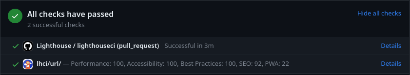
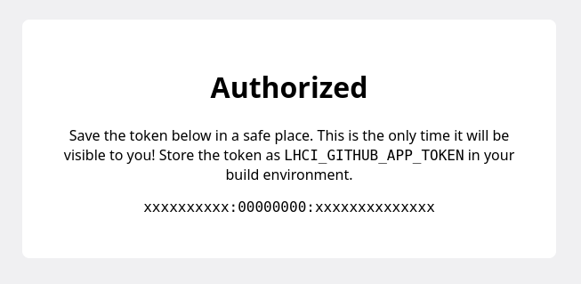
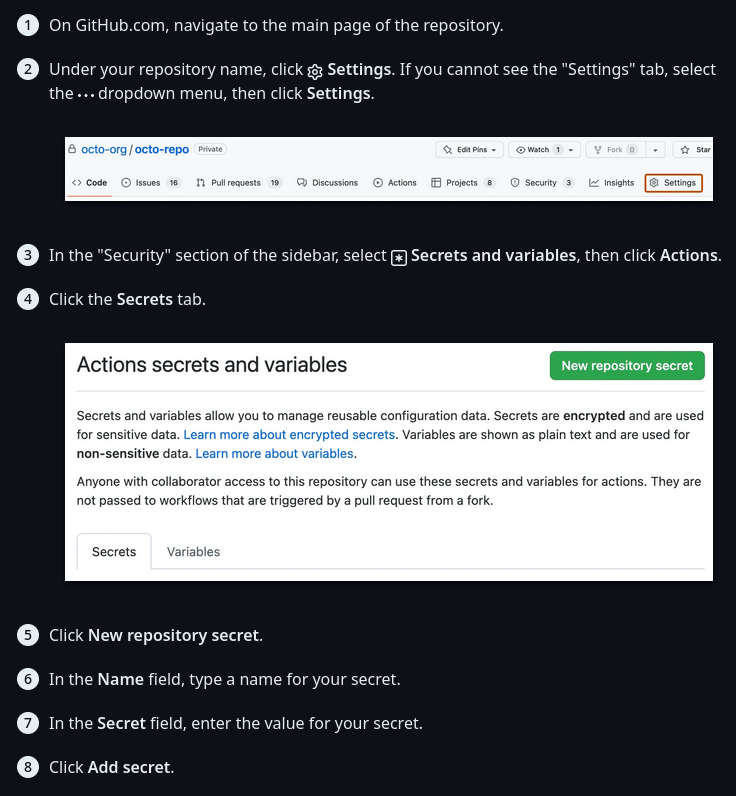

## What is Lighthouse?

[Lighthouse](https://developer.chrome.com/docs/lighthouse/overview/) is an open-source auditing tool for web pages developed by Google.
Web developers use it to optimize some of the metrics that Google [may use](https://developers.google.com/search/docs/appearance/page-experience#is-there-a-single-%E2%80%9Cpage-experience-signal%E2%80%9D-that-google-search-uses-for-ranking)
to rank your site in search results. Countless case studies show that improving your core web vitals can lead to a [lower bounce rate](https://blog.chromium.org/2020/05/the-science-behind-web-vitals.html),
an [increase in page views](https://web.dev/yahoo-japan-news/), and even [higher sales](https://web.dev/farfetch/).
It's integrated into Chromium browsers as a part of the devtools, but it can also be run automatically in a headless environment with
[Lighthouse CI](https://github.com/GoogleChrome/lighthouse-ci).

<figure>



  <figcaption>A Lighthouse report for the homepage of my website.</figcaption>
</figure>

## Running Lighthouse Automatically

Lighthouse CI is incredibly simple to set up locally, and it can be easily run on GitHub Actions using existing packages.

### Step 1: Install the `npm` package

```sh caption="This will install the Lighthouse CI CLI globally, meaning you can run it from anywhere on your system."
npm install -g @lhci/cli@0.12.0
```

### Step 2: Configure Lighthouse CI

See the [configuration reference](https://github.com/GoogleChrome/lighthouse-ci/blob/main/docs/configuration.md) for more details.
The config file should go in the root or source directory of your project.

```json title=".lighthouserc.json"
{
  "ci": {
    "collect": {
      "url": [
        // A list of URLs to test
        "http://localhost:3000"
      ],
      // The command that starts your production server
      "startServerCommand": "npm run start",
      // If a log line contains this text, Lighthouse will start trying to load pages
      "startServerReadyPattern": "started server on",
      // The number of times to run the test for each page
      // (If set to more than 1, results will be combined/aggregated into one report)
      "numberOfRuns": 1,
      "settings": {
        // Switch between desktop and mobile emulation
        "preset": "desktop"
      }
    },
    "assert": {
      // Use recommended audits, including PWA tests
      "preset": "lighthouse:recommended"
    },
    "upload": {
      // Returns a URL which will be valid for a few days
      // and accessible to anyone with the link
      "target": "temporary-public-storage"
    }
  }
}
```

Once it's configured, build your site and run `lhci collect{:sh}` to start Lighthouse CI.
You should see an output similar to this:

```sh caption="Visit the link provided in the output to view your Lighthouse report."
$ lhci collect
Started a web server with "npm run start"...
Running Lighthouse 1 time(s) on http://localhost:3000/
Run #1...done.
Done running Lighthouse!
Uploading median LHR of http://localhost:3000/...success!
Open the report at https://storage.googleapis.com/lighthouse-infrastructure.appspot.com/reports/xxxxxxxxxxxxx-xxxx.report.html
```

### Step 4: Set up GitHub Actions

First, you need to authorize the [LHCI GitHub App](https://github.com/apps/lighthouse-ci)
and copy the token provided on the authorization confirmation page.
The workflow will use this token to add Lighthouse results to the "Checks" list on a pull request.

Here's the GitHub Marketplace link: https://github.com/apps/lighthouse-ci

<figure>



  <figcaption>The GitHub App authorization confirmation page</figcaption>
</figure>

Next, follow [this guide](https://docs.github.com/en/actions/security-guides/encrypted-secrets#creating-encrypted-secrets-for-a-repository)
from the GitHub docs to add the token as an encrypted secret in your GitHub repository:

<figure>



  <figcaption>Your secret name should be `LHCI_GITHUB_APP_TOKEN`.</figcaption>
</figure>

Then, create a new file in your GitHub repository in the `.github/workflows` folder for the LHCI GitHub Actions workflow.

```yml title=".github/workflows/lighthouse.yml"
name: Lighthouse
on:
  push:
    branches:
      - main
  pull_request:
    types: [opened, synchronize, reopened, closed]
    branches:
      - main

jobs:
  lighthouseci:
    runs-on: ubuntu-latest
    steps:
      - uses: actions/checkout@v3
      - uses: actions/setup-node@v3
        with:
          node-version: 16
      - run: npm install && npm install -g @lhci/cli@0.12.0
      - run: npm run build && lhci collect && lhci upload
        env:
          # If you app has any environment variables that
          # are required at build time, add them here:
          LHCI_GITHUB_APP_TOKEN: ${{ secrets.LHCI_GITHUB_APP_TOKEN }}
```

**That's it!** You should now see Lighthouse CI results on your new commits and pull requests:

<figure>


  <figcaption>
    An example of the Lighthouse GitHub App on a pull request.
  </figcaption>
</figure>

## Running only on changed files

Currently, this isn't very useful for sites with many pages;
only the pages you manually add are checked, and every added page is checked every time you run Lighthouse CI.

To solve this problem, I made use of a third-party GitHub Action and a custom Node.js script.
The first thing I did was add the [changed files action](https://github.com/marketplace/actions/changed-files) to my workflow:

```yml {6-7,12-18} title=".github/workflows/lighthouse.yml" caption="fetch-depth: 50 is important because it makes sure enough Git history is pulled to enumerate all the changed files. This assumes that all pull requests will contain fewer than 50 commits."
jobs:
  lighthouseci:
    runs-on: ubuntu-latest
    steps:
      - uses: actions/checkout@v3
        with:
          fetch-depth: 50
      - uses: actions/setup-node@v3
        with:
          node-version: 16
      - run: npm install && npm install -g @lhci/cli@0.12.0
      - name: Get changed files
        id: changed-files
        uses: tj-actions/changed-files@v37
        with:
          separator: ","
      - name: Find changed pages
        run: node get_changed_pages.mjs ${{ steps.changed-files.outputs.all_modified_files }}
      - run: npm run build && lhci collect && lhci upload
        env:
          # If you app has any environment variables that
          # are required at build time, add them here:
          LHCI_GITHUB_APP_TOKEN: ${{ secrets.LHCI_GITHUB_APP_TOKEN }}
```

Then, I created a new JavaScript file in the root of the project
and added some code to separate the input by my specified `separator` (in this case, commas).

```js title="get_changed_pages.mjs"
const changedFiles = process.argv[2].split(",");
```

This is where it gets complicated. If a page was modified directly, we can easily
detect that it was changed and add it to the list of pages to run LHCI on.
However, if a deeply-nested component was changed, its parent page has to be marked as
modified.

My solution is somewhat naive, but it gets the job done in a majority of scenarios.

```js title="get_changed_pages.mjs"
for (const file of changedFiles) {
  if (!file.startsWith("pages/")) {
    // For non-pages (e.g. shared components), we want to recursively
    // find any dependent files and add them to the list of pages to check:
    const dependentPages = Array.from(await findDependentPages(file));
    pagesToCheck.push(...dependentPages);
  } else {
    // For pages, we can add them directly:
    pagesToCheck.push(file);
  }
}
```

Now, we need a method to find which pages depend on a file.
This is a recursive process: first, find all references to the changed file in other files; then, repeat that process for all the files that referenced the changed file.

```js {29} title="get_changed_pages.mjs" caption="On the highlighted line, files' text content is naively searched for references."
// A list of file extensions which should be included in the scan
const whitelistedExtensions = ["ts", "tsx", "js", "jsx", "json"];

async function searchFor(file, keyword) {
  if (existsSync(file)) {
    const stats = lstatSync(file);
    if (stats.isDirectory()) {
      // If this entry is a directory, recursively scan all files inside
      // and return the result.
      return (
        await Promise.all(
          (
            await readdir(file)
          ).map((item) => searchFor(file + "/" + item, keyword))
        )
      ).flat(); // Flatten the result to keep the array 1-dimensional
    } else if (
      stats.isFile() &&
      // Only scan files with certain extensions to save time;
      // binary files are unnecessary to scan and are often very large
      whitelistedExtensions.includes(file.substring(file.lastIndexOf(".") + 1))
    ) {
      // If this entry is a file, search for references to the keyword
      // and return the file's name if a match was found.
      const str = (await readFile(file)).toString();
      if (
        str
          .split("\n")
          .some((line) => line.includes("import") && line.includes(keyword))
      ) {
        return [file];
      }
    }
  }
  // If no matches were found, return an empty list.
  return [];
}
```

This is the main procedure, and it covers the first part of the process.
Now, we need the glue to tie it all together:

```js title="get_changed_pages.mjs"
function cleanFileName(name) {
  // Remove .ts and .tsx file extensions and the "./" before relative paths
  return name.replace(/\.tsx?$/, "").replace(/^.\//, "");
}

async function findDependentPages(file, visited = new Set()) {
  // Create a keyword that we're looking for in project files.
  // In this case, the file name has its preceding path removed
  // because many imports are relative.
  const searchString = cleanFileName(
    file.substring(file.lastIndexOf("/"), file.length)
  );

  // Mark this file as "visited" so that it's not processed multiple times
  visited.add(file);

  const dependentFiles = (
    await Promise.all(
      [
        // All paths relative to the current working directory
        // where project code is found. Used to avoid searching
        // unnecessary directories like `node_modules`.
        "./pages",
        "./components",
      ].map(
        // Search for the `searchString` recursively
        // in the `path` and its child files/directories
        (path) => searchFor(path, searchString)
      )
    )
  )
    .flat(); // Flatten the result to keep the array 1-dimensional
    .filter((page) => !visited.has(page)); // Ignore any pages we've already processed

  // This list will represent all found dependent pages
  let dependentPages = new Set(dependentFiles);

  // This list is a FIFO queue of files that still need to be processed
  let stack = [...dependentFiles];

  // This acts similarly to a non-recursive implementation of a BFS:
  // https://en.wikipedia.org/wiki/Breadth-first_search#Pseudocode
  while (stack.length > 0) {
    const item = stack.shift();
    // Queue up any newly-discovered pages for later processing
    const pages = await findDependentPages(item, visited);
    stack.push(...pages);
    // Add them to our own list so they can be returned at the end
    Array.from(pages).forEach((page) => dependentPages.add(page));
  }

  return dependentPages;
}
```

## Handling dynamic route segments

[The simplest solutions are often the best ones](https://en.wikipedia.org/wiki/Occam's_razor).
To handle this special case, I just replace dynamic route segment placeholders with some "example data"
which would represent the average page.

```js title="get_changed_pages.mjs"
/**
 * Default values for dynamic route segments
 */
const placeholders = {
  category: "technology",
};

// For example, this will replace "/blog/[category]/posts" with
// "/blog/technology/posts" using the placeholders specified above.
function getExamplePage(path) {
  for (const placeholder of Object.keys(placeholders)) {
    path = path.replace(`[${placeholder}]`, placeholders[placeholder]);
  }
  return path;
}
```

### Rewriting the Lighthouse CI configuration

The last piece of the puzzle is rewriting the LHCI configuration with our list of changed pages:

```js title="get_changed_pages.mjs"
let lhciConfig = JSON.parse((await readFile("lighthouserc.json")).toString());
lhciConfig.ci.collect.url = pagesToCheck;
await writeFile("lighthouserc.json", JSON.stringify(lhciConfig, null, 2));
```

## Putting it all together

Here's the full code for my solution.

### GitHub Actions Workflow

```yml title=".github/workflows/lighthouse.yml"
name: Lighthouse
on:
  push:
    branches:
      - main
  pull_request:
    types: [opened, synchronize, reopened, closed]
    branches:
      - main

jobs:
  lighthouseci:
    runs-on: ubuntu-latest
    steps:
      - uses: actions/checkout@v3
        with:
          fetch-depth: 50
      - uses: actions/setup-node@v3
        with:
          node-version: 16
      - run: npm install && npm install @lhci/cli@0.11.x
      - name: Get changed files
        id: changed-files
        uses: tj-actions/changed-files@v37
        with:
          separator: ","
      - name: Find changed pages
        run: node find_changed_pages.mjs ${{ steps.changed-files.outputs.all_modified_files }}
      - run: npm run build && lhci collect && lhci upload
        env:
          LHCI_GITHUB_APP_TOKEN: ${{ secrets.LHCI_GITHUB_APP_TOKEN }}
```

### Node.js Script (`pages/` directory)

```js title="find_changed_pages.mjs"
import { existsSync, lstatSync } from "fs";
import { readFile, readdir, writeFile } from "fs/promises";

/**
 * Page that should never be checked by Lighthouse CI
 */
const exceptions = ["pages/_app", "pages/404"];

/**
 * Default values for dynamic route segments
 */
const placeholders = {
  category: "technology",
};

const whitelistedExtensions = ["ts", "tsx", "js", "jsx", "json"];

function getExamplePage(file) {
  for (const placeholder of Object.keys(placeholders)) {
    file = file.replace(`[${placeholder}]`, placeholders[placeholder]);
  }
  return file;
}

function cleanFileName(name) {
  return name.replace(/\.tsx?$/, "").replace(/^.\//, "");
}

async function findDependentPages(file, visited = new Set()) {
  const searchString = cleanFileName(
    file.substring(file.lastIndexOf("/"), file.length)
  );

  visited.add(file);

  const dependentFiles = (
    await Promise.all(
      [
        "./pages",
        "./components",
        // ...
      ].map((path) => searchFor(path, searchString))
    )
  )
    .flat()
    .filter((page) => !visited.has(page));

  let dependentPages = new Set(dependentFiles);
  let stack = [...dependentFiles];

  while (stack.length > 0) {
    const item = stack.shift();
    const pages = await findDependentPages(item, visited);
    stack.push(...pages);
    Array.from(pages).forEach((page) => dependentPages.add(page));
  }

  return dependentPages;
}

async function searchFor(file, keyword) {
  if (existsSync(file)) {
    const stats = lstatSync(file);
    if (stats.isDirectory()) {
      return (
        await Promise.all(
          (
            await readdir(file)
          ).map((item) => searchFor(file + "/" + item, keyword))
        )
      ).flat();
    } else if (
      stats.isFile() &&
      whitelistedExtensions.includes(file.substring(file.lastIndexOf(".") + 1))
    ) {
      const str = (await readFile(file)).toString();
      if (
        str
          .split("\n")
          .some((line) => line.includes("import") && line.includes(keyword))
      ) {
        return [file];
      }
    }
  }
  return [];
}

let changedFiles = process.argv[2].split(",");
let pagesToCheck = [];

for (const file of changedFiles) {
  if (!file.startsWith("pages/")) {
    const dependentPages = Array.from(await findDependentPages(file));
    pagesToCheck.push(...dependentPages);
  } else {
    pagesToCheck.push(file);
  }
}

pagesToCheck = pagesToCheck
  // Make sure all pages exist
  .filter((it) => existsSync(it))
  // Remove file extension and leading "./"
  .map((page) => cleanFileName(page))
  .filter(
    (it) =>
      it.startsWith("pages/") && // Include only Next.js pages
      !it.startsWith("pages/api") && // Exclude API routes
      !exceptions.includes(it) // Exclude special exceptions
  )
  .map(
    (page) =>
      "http://localhost:3000" + // Prepend the host and port
      // Fill dynamic route segments with sample values
      // and remove parts of the file path with aren't included in the URL
      getExamplePage(page.replace("/index", "").replace("pages", ""))
  )
  .sort();

// Remove duplicates
pagesToCheck = [...new Set(pagesToCheck)];

if (pagesToCheck.length === 0) {
  console.warn(
    "No changed pages found! Only the homepage will be included in the Lighthouse CI report."
  );
  pagesToCheck = ["http://localhost:3000"];
}

console.log("Pages to check:", pagesToCheck);

// Rewrite the Lighthouse config
let lhciConfig = JSON.parse((await readFile("lighthouserc.json")).toString());
lhciConfig.ci.collect.url = pagesToCheck;
await writeFile("lighthouserc.json", JSON.stringify(lhciConfig, null, 2));
```

## Modifying the script for the `app/` directory

1. Instead of checking that each page starts with `pages/`, we need to check if the filename starts with `app/` _and_ ends with `page.tsx`.
2. We also need to filter the dependent pages to make sure they end with `page.tsx`, because in the `app/` directory, components can be colocated with pages.

```diff
 for (const file of changedFiles) {
-  if (!file.startsWith("pages/")) {
+  if (!file.startsWith("app/") || !file.endsWith("page.tsx")) {
     const dependentPages = Array.from(await findDependentPages(file));
-     pagesToCheck.push(...dependentPages);
+     pagesToCheck.push(...dependentPages.filter((page) => page.endsWith("page.tsx")));
   } else {
     pagesToCheck.push(file);
   }
 }
```

3. We need to make similar changes in the code that filters our final list:

```diff
 pagesToCheck = pagesToCheck
   .filter((it) => existsSync(it))
   .map((page) => cleanFileName(page))
   .filter(
     (it) =>
-       it.startsWith("pages/") &&
-       !it.startsWith("pages/api") &&
+       it.startsWith("app/") &&
+       !it.startsWith("app/api") &&
       !exceptions.includes(it)
   )
   .map(
     (page) =>
       "http://localhost:3000" +
-       getExamplePage(page.replace("/index", "").replace("pages", ""))
+       getExamplePage(page.replace("/page", "").replace(/^app/, ""))
   )
   .sort();
```

4. Make sure you add the `app` directory to the list of folders to search for references:

```diff
 const dependentFiles = (
   await Promise.all(
     [
+     "./app",
       "./pages",
       "./components",
       // ...
     ].map((path) => searchFor(path, searchString))
    )
 )
```

5. The list of `exceptions` is no longer necessary, as anything that ends with `page.tsx` in the `app` directory is a standard page.

   _For example: the 404 page is now `not-found.tsx`, and `_app.tsx` is now `layout.tsx`. Neither of them end with `page.tsx`, so we don't have to include a special case for either of them._

```diff
- /**
-  * Page that should never be checked by Lighthouse CI
-  */
- const exceptions = ["pages/_app", "pages/404"];
```

```diff
 pagesToCheck = pagesToCheck
   .filter((it) => existsSync(it))
   .map((page) => cleanFileName(page))
   .filter(
     (it) =>
       it.startsWith("app/") &&
-      !it.startsWith("app/api") &&
-      !exceptions.includes(it)
+      !it.startsWith("app/api")
   )
```

## Limitations

1. Modifications to components referenced in `_app` (`pages` directory) or the root or
   nested layouts (`app` directory) do not trigger testing of every affected page.
   Originally, this was a bug, but it does end up preventing a lot of unnecessary
   CI time, so I am not interested in developing a fix at this time.

2. Some ways of depending on other files may not be recognized. Regular `import` and
   dynamic imports do work provided that the "import" keyword is on the same line as
   the referenced file name.

   > If you have a complex project setup or you want your workflow to be more thorough,
   > you can use a package like [vercel/nft](https://github.com/vercel/nft) (Node File Trace)
   > to find every dependent file for a given source file.

## Caching

You can add a few lines to your GitHub workflow to save dependencies and build output between runs:

```yaml {5-13} title=".github/workflows/lighthouse.yml"
# ...
- uses: actions/setup-node@v3
  with:
    node-version: 18
    cache: "npm" # Cache NPM dependencies
- uses: actions/cache@v3
  with:
    path: | # Cache Next.js build output
      ${{ github.workspace }}/.next/cache
    key: |
      ${{ runner.os }}-nextjs-${{ hashFiles('**/package-lock.json') }}-${{ hashFiles('**/*.js', '**/*.jsx', '**/*.ts', '**/*.tsx') }}
    restore-keys: |
      ${{ runner.os }}-nextjs-${{ hashFiles('**/package-lock.json') }}
```
