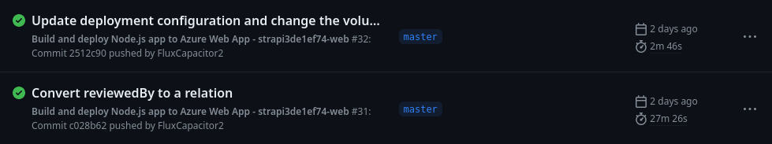
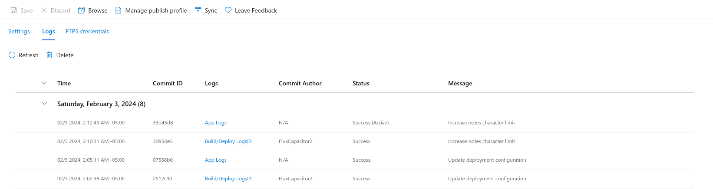
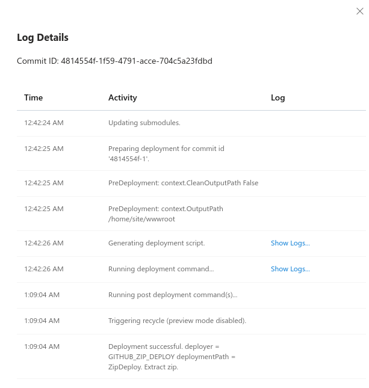
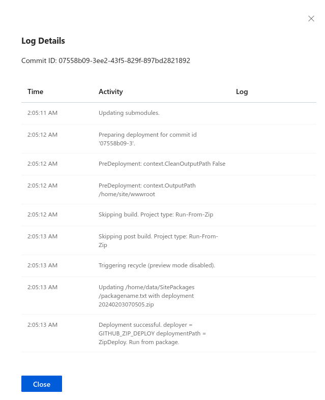

## Background

I've been using Azure App Service for the past few months to host a [Strapi](https://strapi.io/) instance.
When it works, it's a great experience; all you need to do is commit, let it build on GitHub Actions, and wait for it to deploy.
However, for most of my time using it, deploy times have been horrific. Before applying this fix, my Strapi app took between **20 and 30 minutes** to deploy.
Now, I only wait **2 to 3 minutes** for the process to complete.

Here's a before-and-after comparison:



## How do Azure App Service deployment work?

Once you create an App Service resource, you can connect it to a GitHub repository for automatic deployments.
This creates a GitHub Actions workflow file in your repository. Once a `push` event is triggered, the workflow
clones your repository, builds it using an NPM script, runs tests, and then packages your app into a ZIP file.

Then, this ZIP file is uploaded to your App Service instance, and on the receiving end, it is extracted and any
files with a newer last modified date are copied to their final locations.

## Making small optimizations

Here is App Service's auto-generated workflow for a Node.js app:

```yml
# Docs for the Azure Web Apps Deploy action: https://github.com/Azure/webapps-deploy
# More GitHub Actions for Azure: https://github.com/Azure/actions

name: Build and deploy Node.js app to Azure Web App

# Deploy when a push is made to the master branch
on:
  push:
    branches:
      - master
  workflow_dispatch:

jobs:
  build:
    runs-on: ubuntu-latest

    steps:
      - uses: actions/checkout@v2

      - name: Set up Node.js version
        uses: actions/setup-node@v1
        with:
          node-version: "14.x"

      # Install packages and build and test the app
      - name: npm install, build, and test
        run: |
          npm install
          npm run build --if-present
          npm run test --if-present
      # Take the built app and upload it as an artifact
      - name: Upload artifact for deployment job
        uses: actions/upload-artifact@v2
        with:
          name: node-app
          path: .

  # Note that `build` and `deploy` are separate jobs
  deploy:
    runs-on: ubuntu-latest
    needs: build
    environment:
      name: "Production"
      url: ${{ steps.deploy-to-webapp.outputs.webapp-url }}

    steps:
      # Download the artifact that we just uploaded
      - name: Download artifact from build job
        uses: actions/download-artifact@v2
        with:
          name: node-app
      # Finally, upload the app to the Azure App Service instance
      - name: "Deploy to Azure Web App"
        id: deploy-to-webapp
        uses: azure/webapps-deploy@v2
        with:
          app-name: "************"
          slot-name: "Production"
          publish-profile: ${{ secrets.AZUREAPPSERVICE_PUBLISHPROFILE_******************************** }}
          package: .
```

You may notice a few problems with this.

First, it uploads the built app as a GitHub Actions artifact to re-download it in the next step.
For my use case, this is just a waste of resources and time. Separating the two jobs is unnecessary because I am not using the artifact outside of the second job, and

Second, the entire folder is uploaded isntead of packing it into an archive.
For large archives containing over 10,000 files, the creators of the `upload-artifact` action
[warn against this](https://github.com/actions/upload-artifact/issues/172) because file transfer performance suffers.

> _**Note**: since I created my project, App Service has changed its default workflow configuration to address these issues. You can see the updated config [here](https://learn.microsoft.com/en-us/azure/app-service/deploy-github-actions?tabs=applevel%2Cnodejs#3-add-the-workflow-file-to-your-github-repository)._

Addressing these concerns made a small dent in my deploy times, but there had to be something I was overlooking.
Is anyone else experiencing 25-minute deploy times? **What's causing this?**

## Looking at the Azure deployment logs

If we take a look at the GitHub Actions logs, for the majority of the deploy step, nothing is printed to the output.
It would seem as if _nothing is happening_ during this time.

Though, of course, this isn't true! We just have to look a little deeper. I opened up the Azure portal, navigated to my App Service resource, and found the deployment logs in the Deployment Center blade:



Clicking on "App Logs" for a deployment opens up this modal:



Finally, clicking on "Show Logs..." on the "Running deployment command" row up the deployment log from my App Service instance.
The log looks something like this:

```sh
Command: "/home/site/deployments/tools/deploy.sh"
Handling Basic Web Site deployment.
Kudu sync from: '/tmp/zipdeploy/extracted' to: '/home/site/wwwroot'
Copying file: 'Dockerfile'
Copying file: 'README.md'
Copying file: 'docker-compose.yml'
Copying file: 'favicon.png'
Copying file: 'package-lock.json'
Copying file: 'package.json'
Copying file: 'tsconfig.json'
Copying file: 'config/admin.ts'
Copying file: 'config/api.ts'
Copying file: 'config/database.ts'
Copying file: 'config/middlewares.ts'
Copying file: 'config/plugins.ts'
Copying file: 'config/server.ts'
Copying file: 'database/migrations/.gitkeep'
Copying file: 'dist/tsconfig.tsbuildinfo'
Copying file: 'dist/build/0cd5f8915b265d5b1856.png'
Copying file: 'dist/build/1470.b73c7dd6.chunk.js'
Copying file: 'dist/build/1588.b48aad25.chunk.js'
Copying file: 'dist/build/169.8332b0a6.chunk.js'
[lines skipped]
Copying file: 'dist/build/6492.cf1d0105.chunk.js'
Copying file: 'dist/build/6879.9db1e708.chunk.js'
Copying file: 'dist/build/6888.de5157cc.chunk.js'
Copying file: 'dist/build/7052.c7a9fe1f.chunk.js'
Copying file: 'dist/build/70674f63fc3904c20de0.svg'
Copying file: 'dist/build/7556.525eedb7.chunk.js'
Omitting next output lines...
Processed 760 files...
Processed 1613 files...
Processed 2278 files...
Processed 2986 files...
Processed 3812 files...
Processed 4525 files...
Processed 5356 files...
Processed 6172 files...
[more lines skipped]
Processed 55173 files...
Processed 55893 files...
Processed 56685 files...
Processed 57477 files...
Processed 58272 files...
Processed 59152 files...
Processed 59983 files...
Processed 60801 files...
Finished successfully.
```

## Learning about App Service's deployment process

At the end of the GitHub Actions workflow, a ZIP file containing the app is uploaded to App Service.
On my App Service instance, a tool called [Kudu](https://github.com/projectkudu/kudu) extracts the ZIP file,
compares the timestamps on each file within the ZIP to the currently-deployed version, and overwrites
the file if the ZIP entry's timestamp is newer.

_**Note**: Kudu is a multi-purpose tool that handles many different things outside of syncing files.
For more information, check out [Microsoft's documentation](https://learn.microsoft.com/en-us/azure/app-service/resources-kudu)._

Since Strapi is a Node.js application, it relies on a huge `node_modules` folder to run.
**Every single file in `node_modules` is checked**, even if no packages were changed between deployments.

Notice how the "Copying file" lines only occur at the beginning. After the first 760 files,
none were different and therefore none needed to be copied. In my case, this process is the reason why deploy
times are so slow.

## So, what can we do about it?

In a fit of desperation, I found the GitHub repository for App Service's deployment GitHub Action and started reading all of the open issues.

Finally, I found [this comment](https://github.com/Azure/webapps-deploy/issues/229#issuecomment-1221419505), which suggested I run the app
from a ZIP package.

In 2020, Azure added support for running an App Service app [directly from a ZIP file](https://learn.microsoft.com/en-us/azure/app-service/deploy-run-package).
The file is mounted onto the `/home/wwwroot` directory (`D:\home\site\wwwroot` for Windows apps), enabling atomic deployments, faster cold starts, and (most importantly for me) **much faster deployments**.

Before proceeding, I highly recommend you read the [documentation](https://learn.microsoft.com/en-us/azure/app-service/deploy-run-package) to understand the drawbacks of this approach. The main issue is that the `wwwroot` folder becomes **read-only**, but this doesn't affect me since I am running Strapi with an external database.

### Applying the fix

It is extremely simple to enable running your application directly from a ZIP package.
You can complete this process from either the Azure portal or the CLI.

**In the Azure portal**, navigate to your App Service resource.

1. In the sidebar, select the "Environment variables" blade.
2. Scroll down if necessary. In the "Enter name" box, type `WEBSITE_RUN_FROM_PACKAGE`.
3. In the "Enter value" box, type `1`.
4. Click "Apply". Your entry should look like this:


Or, **using the Azure CLI**, run the following command:

```sh
az webapp config appsettings set --resource-group <group-name> --name <app-name> --settings WEBSITE_RUN_FROM_PACKAGE="1"
```

After changing this setting and redeploying the app, the "Running deployment command" item doesn't even show up in this list.



Looking at the timestamps, **the whole deployment took under a minute**, down from about 25 minutes.

Also, since the `wwwroot` folder is now read-only, deployments are more atomic and
old versions of the app won't be able to access files that are part of a new deployment.
