## Background

**Citizen science projects** allow ordinary people to collect or label data for use by scientists and researchers.
This model is powerful because it allows the project's leaders to gather data from all over the world with a fraction of the time or expense, and it helps scientists share their research to a broad audience.

The [DarkSky International](https://darksky.org/) and the National Science Foundation's [NOIRLab](https://noirlab.edu/public/) have created a
citizen science project called [Globe At Night](https://globeatnight.org/) that allows users to submit observations of the night sky via their website.

To submit an observation, contributors go outside 0-2 hours after sunset but before the Moon rises, wait 10-15 minutes for their eyes to adjust,
find a constellation in the night sky, and compare their view to a series of charts. The chart that appears closest to reality determines the limiting magnitude to submit. The form also includes questions about location, cloud cover, and extra comments if applicable. Then, the observation is added to Globe At Night's data, which they release yearly.

If you want to submit your own observation, check out the submission form [here](https://app.globeatnight.org/). It only takes a few minutes, and it'll help map light pollution across the world.

You can also find other citizen science projects with [CitizenScience.gov's project catalog](https://www.citizenscience.gov/catalog/#).

### Limiting Magnitude

Astronomers use a logarithmic **stellar magnitude** system to measure the relative brightness of stars in the night sky.
The star Vega is the benchmark, with a magnitude of 0. Brighter objects have _lower_ magnitudes on this scale, so the sun has the lowest magnitude and the dimmest stars have the highest magnitudes. The scale is logarithmic, so decreasing magnitude by 1 results in a 2.512x increase in brightness.

**Limiting magnitude** is the highest magnitude (the stellar magnitude of the faintest star) that you can see during an observation. As limiting magnitude increases, relative visibility increases because you can see dimmer stars.
Therefore, an observation with a low limiting magnitude value represents one with a lot of light pollution.

Globe At Night allows contributors to report limiting magnitudes between 0 and 7. For context, here is a table of some common magnitudes:

<figure>

| Object                                       | Stellar Magnitude |
| -------------------------------------------- | ----------------- |
| The Sun                                      | -26.98            |
| The Moon                                     | -12.7             |
| Venus                                        | -4.92             |
| Jupiter                                      | -2.94             |
| Mars                                         | -2.94             |
| Mercury                                      | -2.48             |
| Saturn                                       | -0.55             |
| Sirius (the brightest star in the night sky) | -1.46             |
| Polaris (the North Star)                     | +1.98             |
| The faintest stars visible to the naked eye  | +6-7              |

<figcaption>

Data source: [Wikipedia](https://en.wikipedia.org/wiki/List_of_brightest_stars)

</figcaption>
</figure>

So, if your limiting magnitude is N, you should be able to see all stars with a stellar magnitude less than N. Globe At Night provides some [reference charts](https://globeatnight.org/magnitude-charts/) that depict common constellations at various limiting magnitudes:

<figure>

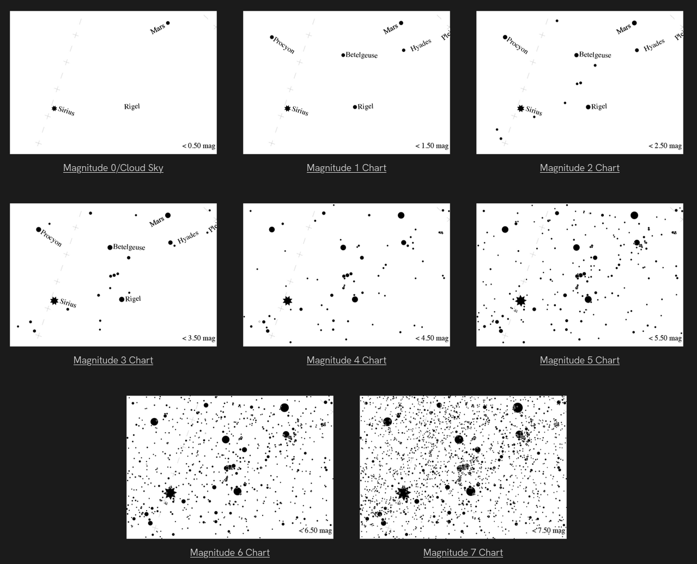

<figcaption>Globe At Night's reference limiting magnitude charts for the constellation Orion.</figcaption>
</figure>

Read more about stellar magnitude [here](https://www.atnf.csiro.au/outreach/education/senior/astrophysics/photometry_magnitude.html).

## Ingesting The Data

Globe At Night publishes [data](https://globeatnight.org/maps-data/) by year in many different formats.

<figure>

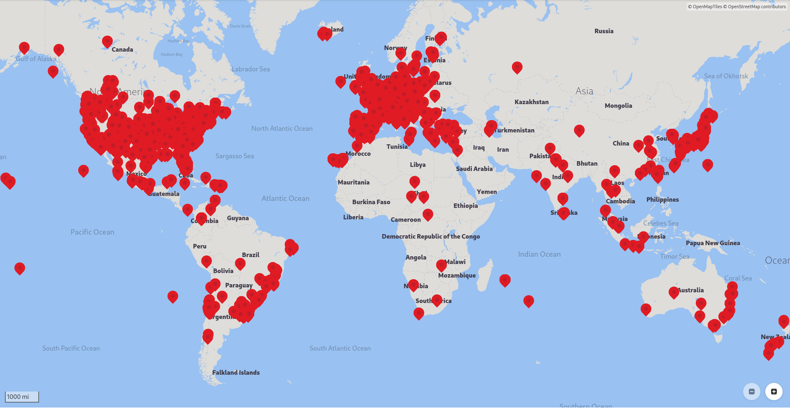

<figcaption>

In 2019, Globe At Night collected 10,197 total observations. Here is the [KML](https://en.wikipedia.org/wiki/Keyhole_Markup_Language) file available on their website for that year, opened with the [GNOME Maps app](https://apps.gnome.org/Maps/).

</figcaption>
</figure>

For the purposes of this project, I downloaded the data from each year as a CSV. Observations looked like this:

```csv title="GaN2023.csv"
ID,ObsType,ObsDateTime,Latitude,Longitude,Elevation,UTCOffset,LimitingMag,CloudCover,SQMReading,SQMSerial,Constellation,SkyComment,LocationComment,Country
318034,Globe at Night,2023-06-06 20:14:00+00:00,46.2865733,16.3471,167.57,120,6,0,,,Bootes,,,Slovenia
317628,Globe at Night,2023-09-29 12:49:00+00:00,0.0,0.0,0.0,240,3,0,,,Pegasus,Haze north,,India
316942,Globe at Night,2023-12-31 02:23:00+00:00,24.083934722929097,-110.19840839469441,375.97,-420,6,0,20.52,,Perseus,,,Mexico
315605,Globe at Night,2023-08-12 04:42:00+00:00,33.23302687438303,-86.76657842107028,207.65,-300,4,0,,,Scorpius,Clear Night Sky,Clear view of night sky,United States - Alabama
315604,Globe at Night,2023-08-12 04:42:00+00:00,0.0,0.0,0.0,-300,6,0,,,Sagittarius,Clear Night Sky,Clear view of night sky.,United States - Alabama
313952,Globe at Night,2023-10-24 11:13:00+00:00,34.266383988594605,135.1518275462784,85.71,540,3,25,,,Perseus,,,Japan
313951,Globe at Night,2023-11-25 11:53:00+00:00,34.26637484717639,135.1518427578752,85.68,540,4,0,,,Perseus,,,Japan
313950,Globe at Night,2023-12-18 13:28:00+00:00,34.14335584160156,135.3859642564247,143.48,540,4,25,,,Orion,,,Japan
313923,Globe at Night,2023-10-26 13:00:00+00:00,34.59131446909084,135.5091450736569,14.73,540,2,25,,,Pegasus,,,United States - Alabama
[...]
```

In total, the 18 files contained over 290,000 rows and weighed about 52 MB. I wanted to run my queries and visualizations on the entire dataset, which was over 290,000 rows, so I couldn't just shove all the data into a Google Sheet. My first thought was to use [SQLite](https://sqlite.org/) to query and aggregate the data and then graph the results.

```fish
❯ sqlite3 GaN.db
SQLite version 3.46.1 2024-08-13 09:16:08
Enter ".help" for usage hints.
sqlite> .import --csv GaN2006.csv observations
sqlite> .import --csv GaN2007.csv observations
sqlite> .import --csv GaN2008.csv observations
sqlite> .import --csv GaN2009.csv observations
sqlite> .import --csv GaN2010.csv observations
sqlite> .import --csv GaN2011.csv observations
sqlite> .import --csv GaN2012.csv observations
# ...
sqlite> .import --csv GaN2023.csv observations
sqlite> select count(*) from observations;
291306
sqlite>
```

We now have a database table with 291,306 rows ready for us to make some queries.

## Cleaning

There are a few odd things I've found with this dataset. Considering it's citizen science, some errors are to be expected, but we have to make sure
to get rid of them before making visualizations with them. For example, some people failed to add their location, so their latitude and longitude is (0, 0). Some others couldn't determine a limiting magnitude, so the recorded value is a negative number.

Here are a few of the queries I ran to remove invalid rows:

```sql
delete from observations where ID = 'ID'; -- Remove header rows from files imported after the first one
delete from observations where LimitingMag < 0 or LimitingMag > 7;
delete from observations where ObsDateTime > date('now');
delete from observations where Latitude = 0.0 and Longitude = 0.0;
```

We are now down to 251,138 rows (40,168 invalid rows!). I also dropped the country, location and sky comment columns since I didn't need them and wanted to reduce the database's file size:

```sql
alter table observations drop column Country;
alter table observations drop column LocationComment;
alter table observations drop column SkyComment;
vacuum; -- `vacuum` is A SQLite-specific command that compacts
        -- the database, removing deleted pages to save storage space.
```

The database was now 24.7 MB, which is less than half the size of the original CSVs!

## Queries

Now, I'm going to go through some of the questions I had about the data and how I answered them with SQL queries on the `observations` table.
The data on the left is the output of the corresponding SQL query.

### 1. What effect does elevation have on limiting magnitude?

```sql
select LimitingMag, avg(Elevation) from observations group by LimitingMag;
```

<figure>

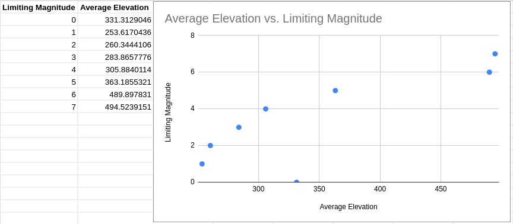

<figcaption>

As elevation increases, limiting magnitude generally **increases**, as you might expect. It's easier to see stars from higher elevations.

</figcaption>
</figure>

### 2. Do different constellations have different average limiting magnitudes?

```sql
select Constellation, avg(LimitingMag) from observations group by Constellation;
```

<figure>

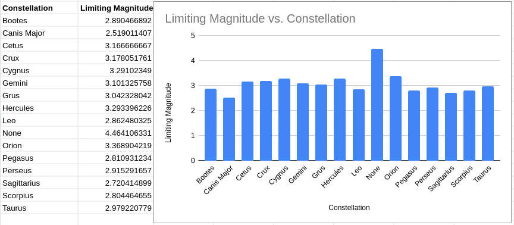

<figcaption>

Limiting magnitude stays generally consistent across different constellations, which is a good indicator for the quality of the data.

</figcaption>
</figure>

### 3. How many times was each limiting magnitude observed?

```sql
select LimitingMag, count(*) from observations group by LimitingMag;
```

<figure>

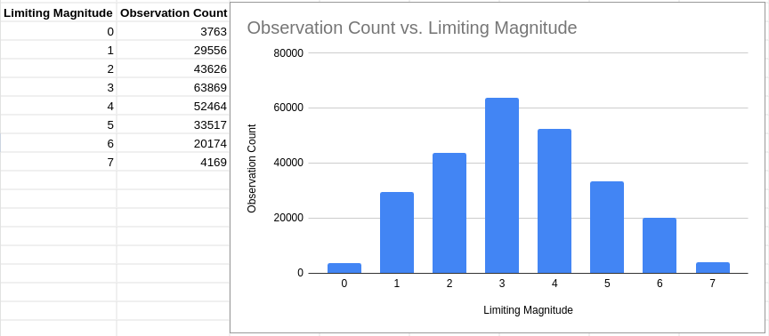

<figcaption>

Most observations recorded a limiting magnitude of 3, with the mean being between 3 and 4.

</figcaption>
</figure>

### 4. What was the average limiting magnitude across all observations?

```sql
select avg(LimitingMag) from observations;
```

```sql
3.32917758363927
```

### 5. How has the amount of observations recorded changed over the years?

```sql
select strftime('%Y', ObsDateTime) as ObsYear, count(*) from observations group by ObsYear;
```

<figure>

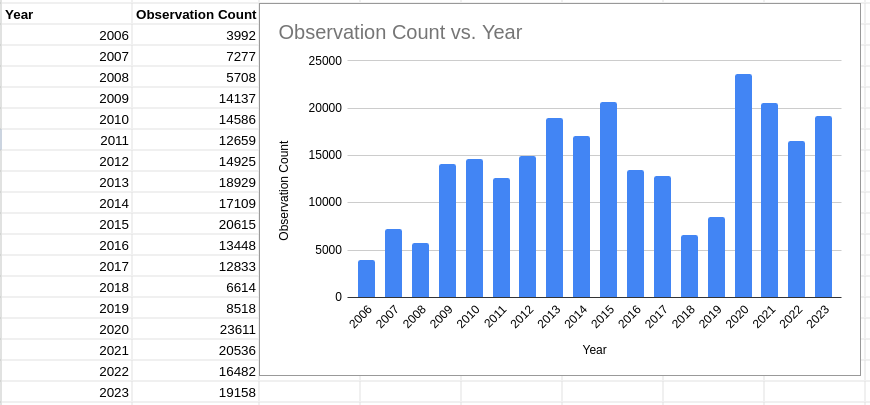

<figcaption>

Yearly recorded observation numbers generally increased, with a slump from 2016-2019. In 2023, there were 19,158 valid observations recorded.

</figcaption>
</figure>

### 6. Which constellations are the most popular to observe?

```sql
select Constellation, count(*) from observations group by Constellation;
```

<figure>

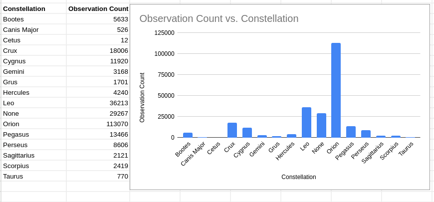

<figcaption>

The most popular constellation to observe was Orion, which makes sense because it's visible in the northern hemisphere, where most population centers are, and it's one of the most visible constellations in the night sky.

</figcaption>
</figure>

### 7. Has limiting magnitude changed over time?

```sql
select strftime('%Y', ObsDateTime) as ObsYear, avg(LimitingMag) from observations group by ObsYear;
```

<figure>

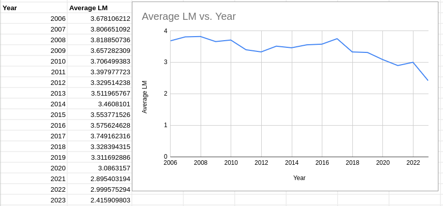

<figcaption>

Average limiting magnitude has decreased over the lifetime of the Globe At Night project.

</figcaption>
</figure>

This graph shows a disturbing trend. Over the past 18 years, the average limiting magnitude of Globe At Night observations has dropped from 3.68 to 2.42. That's a drop of 1.26 points, an average of 0.07 points per year.

This shows that, assuming there has not been a significant change in data collection methadology or sampling biases over the past 18 years,
light pollution globally is now worse than it was 18 years ago.

## Datasette

[Datasette](https://datasette.io/) is an open-source data visualization and analysis tool that I found while researching for this project. It allows you to quicky gain insights from any SQLite database.

I installed it with `pip`:

```sh
pip install datasette
```

Then, you can just run `datasette <filename>`, where `<filename>` is the name of the file that contains your database.

After that, I navigated to http://127.0.0.1:8001/ in my browser and clicked on the `observations` table.
Datasette will suggest facets for you to add:

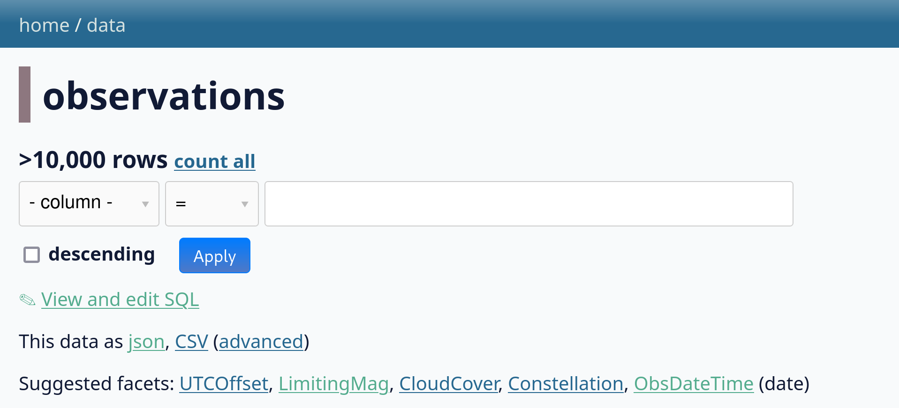

I clicked on a few. Facets allow you to quickly see the most common values for a given column in your table:

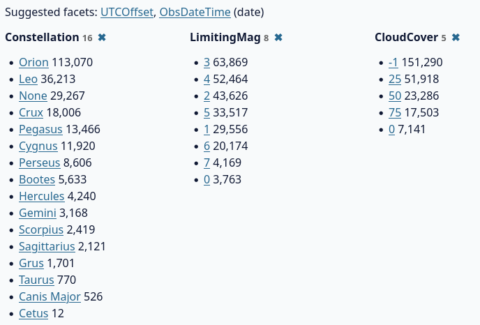

This immediately tells us that the most common constellation observed was Orion, the most common limiting magnitude was 3, and most observations did not include a cloud cover estimation (`-1` instead of a rough numeric value out of `100`).

Datasette also gives us a sample of the data. Clicking on any of the column headers allows you to sort, facet by, or hide the column entirely.

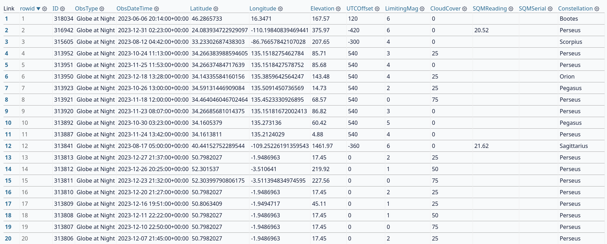

The reason why Datasette is so powerful is that it can be easily extended with Python. It already has a large [plugin repository](https://datasette.io/plugins), and installing plugins is as simple as a `pip install`. I found one that will help me explore the Globe At Night data: [`datasette-cluster-map`](https://datasette.io/plugins/datasette-cluster-map). It looks for latitude and longitude columns in your table and creates a map of all the points in your dataset.

I installed it with this command:

```sh
pip install datasette-cluster-map
```

After restarting Datasette, a map appeared above the data table:

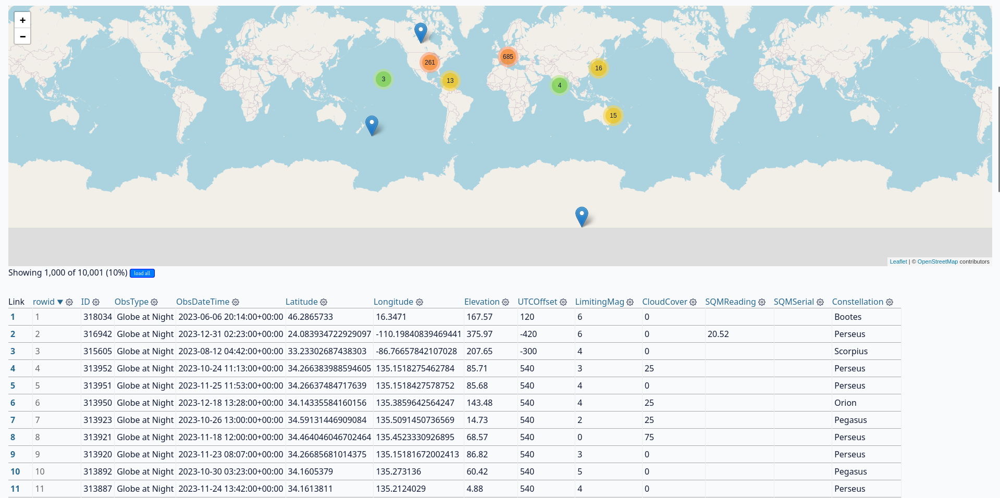

Below, it offers an option to load every row in your table:

<figure>


<figcaption>It says there are 10,001 rows, but the real quantity is far higher. Clicking "Load All" still loads all the rows.</figcaption>
</figure>

That's more like it!

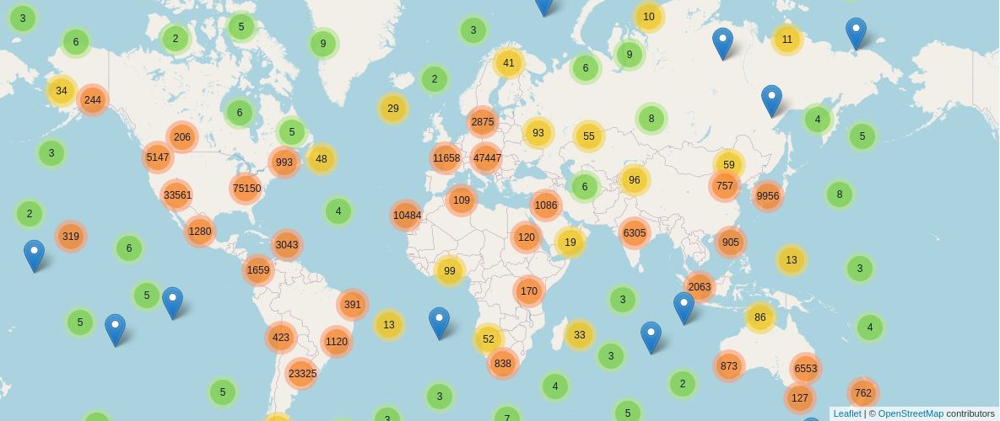

Clicking on one of the circles zooms you in and displays more, smaller clusters.
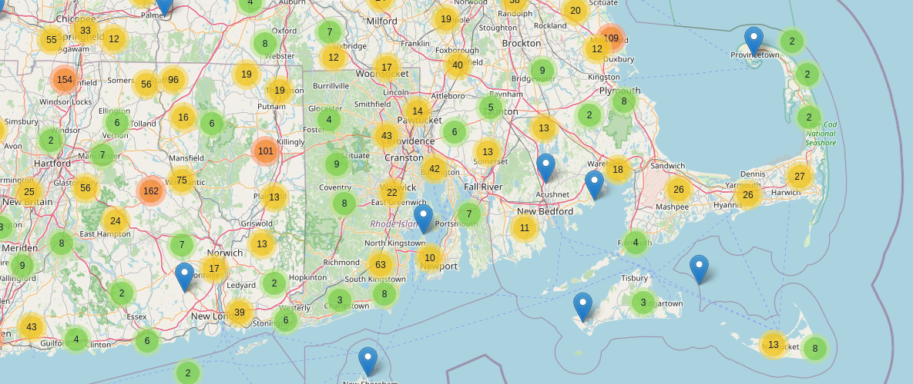

Eventually, you can get close enough to see individual observations (the blue map markers).

<figure>

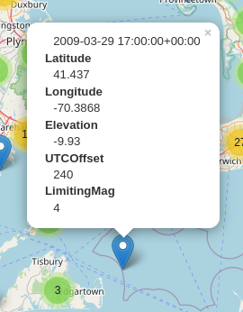

<figcaption>Visibility was pretty good here in 2009!</figcaption>
</figure>

This plugin can be really useful for visualizing light pollution in areas near you where you can envision light sources causing reduces visibility. You can also compare nearby observations side-by-side to see if light pollution in one area varies or has changed over the years.

It also just looks really cool.

If you play around with this, you will notice that the limiting magnitude in big cities typically doesn't surpass 2 or 3 due to light pollution caused by street lights and lights on buildings.

## Making a globe animation with `react-globe.gl`

As part of a [web page](https://fluxcapacitor2.github.io/globe-at-night/) I was making about light pollution and Globe At Night,
I wanted to create a heatmap of Globe At Night observations. That way, I could showcase where most of the observations were
and explain that the project has contributors worldwide.
For this project, I didn't want to set up or maintain a server, so the site had to be completely static.

First, I searched for existing visualization libraries or implementations I could reference.
I was lucky enough to find [react-globe.gl](https://github.com/vasturiano/react-globe.gl), a Three.js globe
with some prebuilt visualization layers. All I had to do was gather my data and convert it into the format the library expects.

I knew that I had a lot of data to visualize, so I had to send it to the browser in the most compact format possible.
I tried configuring Vite with [a Rollup plugin](https://github.com/vitejs/vite/discussions/8271#discussioncomment-2799354) to import CSVs
as ES Modules on the client, but the files were too large; the browser _really_ struggled to parse and execute them.

This is when I thought of using SQLite in the browser. I had read about this previously in a [Notion engineering blog post](https://www.notion.so/blog/how-we-sped-up-notion-in-the-browser-with-wasm-sqlite)
and had wanted to try it ever since. Essentially, SQLite can be compiled to WebAssembly and shipped to the browser, allowing you to query a full SQL database in the browser. You can see this as a successor to [Web SQL](https://www.w3.org/TR/webdatabase/), which was a browser feature that allowed
websites to access a SQL database via JavaScript. Check out [this excellent blog post](https://nolanlawson.com/2014/04/26/web-sql-database-in-memoriam/) for a history of Web SQL and why it eventually failed.

When visitors load the site, a script will:

- Download a precompiled SQLite WASM binary
- Download the full database file
- Query the database for a random sample of observations
- Convert the data into a format usable by `react-globe.gl`
- Render a visualization

Is this inefficient? Yes. Would it have been a better user experience to bake the visualizations on the server and only send the necessary data to the client? Yes.
But I only had so much time to finish the site, and the technology involved in this is really cool.

I used [sql.js](https://sql.js.org) to handle loading the SQLite binary and importing the dataset. This made it really easy:

```ts
import initSqlJs from "sql.js";
import databaseURL from "/data.db?url"; // <-- This is a Vite feature. `databaseURL` contains the URL to the `data.db` file in the public directory.

const SQL = await initSqlJs({
  locateFile: (file) => {
    // This function is used to determine where to load the SQLite WASM binary from.
    // Ideally, you should host it yourself, but this is just a quick hobby project with minimal usage.
    return `https://sql.js.org/dist/${file}`;
  },
});

// Download the entire database
const data = await (await fetch(databaseURL)).arrayBuffer();
const db = new SQL.Database(new Uint8Array(data));

// Select a random sample of 1,000 observations from the 2010s to display
const res = db.exec(
  "select ID, Latitude, Longitude, LimitingMag from observations where ObsDateTime like '201%' order by random() limit 1000;"
);

return res;
```

Then, with the data, we can create a visualization using `react-globe.gl`:

```jsx
import Globe from "react-globe.gl";
import globeTexture from "/earthmap4k.jpg?url"; // Use a globe texture from the public directory

export const GlobeVisualization = ({ data }) => {
  const processed = useMemo(
    () => data[0].values.map((row) => ({
        id: row[0],
        lat: row[1],
        lng: row[2],
        weight: 1, // Weight the heatmap according to the number of observations; more observations = more red.
      })),
    [data]
  );

  return (
    <Globe
      globeImageUrl={globeTexture}
      heatmapsData={[processed]}
      heatmapPointLat="lat"
      heatmapPointLng="lng"
      heatmapPointWeight="weight"
      heatmapTopAltitude={0.02}
      heatmapsTransitionDuration={0}
      heatmapBandwidth={0.9}
      heatmapColorSaturation={1.0}
      enablePointerInteraction={false}
  );
};
```

The Earth texture I used was from [here](https://planetpixelemporium.com/earth8081.html). Here's what it looks like:

<figure>


<figcaption>The 2D image wrapped around the 3D globe, created with a composite of public-domain satellite imagery.</figcaption>
</figure>

The real component is [a bit more complicated](https://github.com/FluxCapacitor2/globe-at-night/blob/main/app/components/Earth.tsx#L5), but this is all you need to create a 3D globe and display your data. The full source code is available [here](https://github.com/FluxCapacitor2/globe-at-night).

Here's what it looks like:

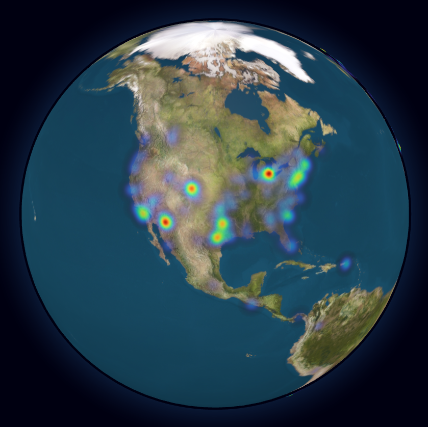

You can see Globe At Night observations from all around the world.
Most of them are concentrated in population centers, as you would expect, but
the project has far more reach than I originally thought.

Now, let's take a step back from the data and remember what this endeavor can teach us.

## Why is reducing light pollution important?

Keeping light pollution levels low is important for a number of reasons.
Here are a few of the most important ones:

1. Light pollution affects the circadian rhythms of humans and other animals, which causes sleep disruption.
2. Artificial light can confuse animals and throw off their behavioral and migratory patterns.
3. Excessive light pollution makes it harder for astronomers to observe the night sky and diminishes its natural beauty.
4. Light pollution is a side effect of unnecessary lighting, which is a waste of energy.

## What can we do to reduce light pollution?

Luckily, reducing light pollution on a local scale is quite easy! Here are a few things you can do:

- Choose "warmer" LED lights that emit less blue light ([more info](https://darksky.org/news/the-promise-and-challenges-of-led-lighting-a-practical-guide/#:~:text=Blue%20Light%20Is%20Bad), [research article](https://pmc.ncbi.nlm.nih.gov/articles/PMC8835293/))
- Use light fixtures that low to the ground, point downward, and shielded to prevent light leakage
- Switch off outdoor lights when not in use, or consider installing timers or motion sensors that automatically turn off lights when they don't need to be on
- Petition your HOA and/or local government to consider light pollution when choosing outdoor or street lighting
- Make a Globe At Night observation to help scientists map light pollution globally
- Sign [petitions](https://www.astro.princeton.edu/~gbakos/satellites/) advocating for preventing companies from spoiling our night sky with satellite constellations
- Share this information with others!
