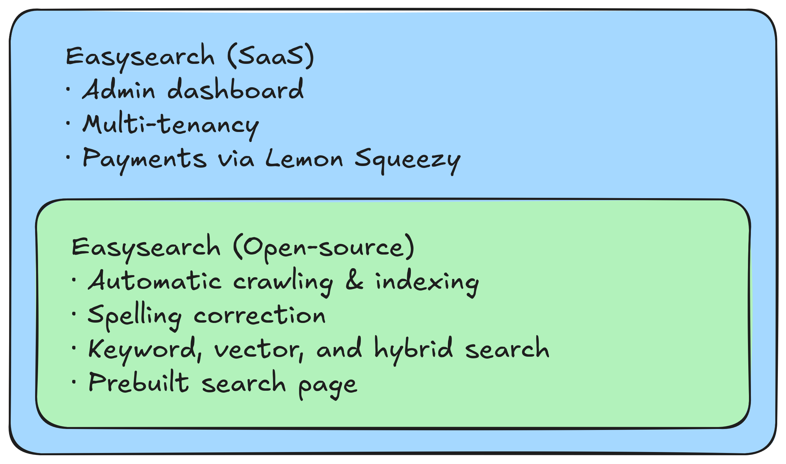
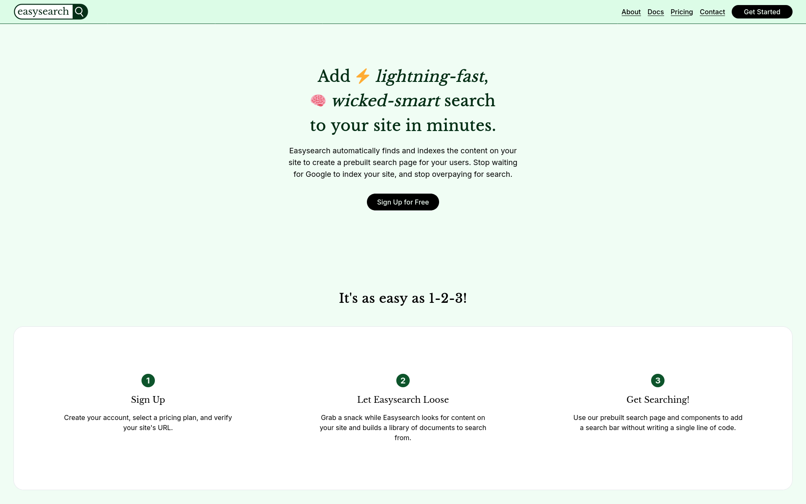
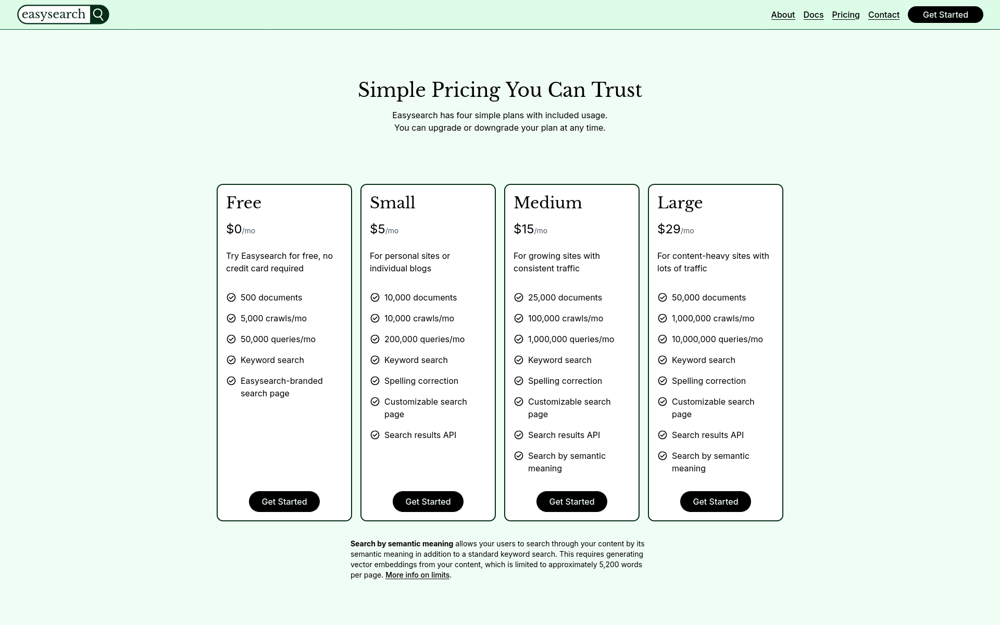

Easysearch is a simple way to add search to your website. You start it up with your site's URL, and it will find every page using a web crawler and build a search index for you. It comes with a prebuilt search page, or you can use the JSON results API for complete customization.

## Table of Contents

- [Why?](#why)
- [Key Features](#key-features)
- [The Open-Core Model](#the-open-core-model)
- [Diving Into Go and SQLite](#diving-into-go-and-sqlite)
- [Challenges](#challenges)
- [What I've Learned](#what-ive-learned)
- [Technologies](#technologies)
- [Setup, Configuration, and Development](#setup-configuration-and-development)

## Why?

I wanted to add a search function to a website I was building. When I researched my available options, I found that:

- Google [Programmable Search Engine](https://programmablesearchengine.google.com/about/) (formerly Custom Search) wasn't customizable with the prebuilt widget and costs $5 per 1000 queries via the JSON API. It also only includes pages that are indexed by Google, which site owners have no control over.
- [Algolia](https://www.algolia.com/) is a fully-managed solution that you can't self-host. Crawling is an additional cost, and individual queries are reasonably expensive.
- A bespoke search solution could return the best quality results, but it takes time to build for each site and must be updated to reflect schema changes.

Easysearch is a free and open-source alternative to the aforementioned products that addresses my primary pain points. **It's simple, runs anywhere, and lets you own your data.**

If you want to forgo the hassle of configuring and managing Easysearch, you can also use the hosted version. It comes with a dashboard to manage your search indexes, customize your search pages, and grant API access.

## Key Features

- Automated crawling and indexing of your site
- Refresh indexed pages on a schedule
- Spelling correction using a vocabulary built from your content
- Vector and hybrid search to find matches based on semantic similarity with the query
- Sitemap and feed scanning
- A JSON API for search results
- A prebuilt search page that works without JavaScript (with [progressive enhancement](https://developer.mozilla.org/en-US/docs/Glossary/Progressive_Enhancement) for users with JS enabled)

## The Open-Core Model

The [open-source version of Easysearch](https://github.com/FluxCapacitor2/easysearch) includes all the key features listed above &mdash; everything you need to build a smart, fast search for your website.

Inspired by [Gatus](https://gatus.io/)'s business model, I created a proprietary software-as-a-service (SaaS) platform on top of the open-source edition. The SaaS platform makes it even easier to set up and configure Easysearch and handles hosting for a small monthly fee.

<!-- Diagram created with Excalidraw: https://excalidraw.com/#json=V14mQlu_5Z34EQcKBqiGJ,duqNqb9V62Xg1bEjtMKjyQ -->

## Diving Into Go and SQLite

When I first started building Easysearch, I knew I wanted it to be as simple as possible to deploy and manage. This led me to choose the Go programming language because it allows you to compile your application and all its dependencies into a single executable.

For simplicity's sake, I chose SQLite as the database.
It stores data in a single file, it has an official extension for full-text search, and for my target audience of small to medium-scale websites, scaling it would not be a concern. This gave me the opportunity to write more [advanced SQL queries](https://github.com/FluxCapacitor2/easysearch/blob/f275292025654049d3e8d1de188ac335a95c89e6/app/database/db_sqlite.go#L401-L487) with CTEs and multiple JOINs, compile and load extensions, and [dive deeper into SQLite's internals](/blog/exploring-sqlite-internals/).

## Challenges

### User Authentication

To learn more about web application security, I decided to implement my own session-based authentication from scratch.

Since Easysearch is a web service intended to be exposed to the public, I had to treat all user input as malicious before sanitizing it &mdash; especially in the SaaS platform. My favorite resources during this process were [the OWASP Cheat Sheet Series](https://cheatsheetseries.owasp.org/index.html) and [The Copenhagen Book](https://thecopenhagenbook.com/). They acted as a spec for a secure authentication system and helped me write mitigations for:

- Cross-Site request forgery (CSRF tokens; SameSite cookies; referrer validation)
- Clickjacking (strict embedder policy)
- Bruteforcing (rate limiting; account lockout)
- Cross-site scripting (content security policy)

### Hybrid Search

Easysearch started as a simple full-text/keyword search. To improve results, I added vector similarity search with the [OpenAI Embeddings API](https://platform.openai.com/docs/guides/embeddings/) and [`sqlite-vec`](https://github.com/asg017/sqlite-vec); however, at the time, vector search results were displayed separately from full-text results. To combine these results into a single page of results, I implemented [reciprocal rank fusion](https://learn.microsoft.com/en-us/azure/search/hybrid-search-ranking) (RRF), an algorithm that merges sorted sets of results based on rankings in each constituent set.

[My current implementation](https://github.com/FluxCapacitor2/easysearch/blob/f275292025654049d3e8d1de188ac335a95c89e6/app/database/db_sqlite.go#L401-L487) is based on [Alex Garcia's RRF example](https://alexgarcia.xyz/blog/2024/sqlite-vec-hybrid-search/index.html#hybrid-approach-2-reciprocal-rank-fusion-rrf) with added support for multiple vector result sources.

### Designing a Brand Identity

When I started working on the SaaS version of Easysearch, I had to figure out what I wanted my brand to look like.
I wanted to heavily lean into the product's ease-of-use, so I chose a friendly, approachable aesthetic.

- The primary color would be green because it feels natural and calming.
- The display font would be a serif font to contrast with the cutting edge; you can set it up yourself, no IT professionals needed.

I also made a logo featuring the word "Easysearch" in a search bar using [an SVG editor](https://boxy-svg.com/).

I think it turned out really well, especially considering I don't have any formal web design training.

I'm also really satisfied with these small animations on the home page.

<video loading="lazy" preload="none" data-src="/content/projects/easysearch/tree-animation.webm" autoplay controls loop></video>
<video loading="lazy" preload="none" data-src="/content/projects/easysearch/hybrid-search-animation.webm" autoplay controls loop></video>

The design is still a work in progress, but I'm proud of what I've achieved on my own.

## What I've Learned

**Prioritize simplicity over scalability.**

When I started building Easysearch, I chose to run a single worker, build the dashboard and marketing site as static sites, and use SQLite instead of a client-server database. These decisions have made it so much easier to add and deploy new features, and I can continue to scale vertically until I have so many users that it would be very lucrative to invest in horizontal scaling.

This also includes cutting out dependencies and third-party services. Many web developers today rely on third-party services for critical features, like Clerk for authentication or Upstash for rate limiting, where it would be much simpler and cheaper to host your app on a VPS and implement those features yourself.

It has also been interesting using the Go programming language. It's much simpler than Kotlin, Java, and TypeScript; it has 25 keywords, while Java has about 50, and it doesn't have syntactic sugar like nullish coalescing or ternaries. Because of this 'forced simplicity', it's much easier to understand someone's intent in the Go code they wrote. While it does tend to make your files longer, I appreciate how expressive it is.

**SQLite is more than enough for most applications.**

SQLite has been going through a bit of a renaissance lately, with more and more people realizing (myself included) that SQLite is really fast [when configured correctly](https://kerkour.com/sqlite-for-servers).

I've also done a [deep dive into SQLite's internals](/blog/exploring-sqlite-internals/), which has taught me a ton about how database engines run queries and how I can optimize my query performance.

**Building authentication from scratch is time-consuming, but it was completely worth it.**

Typically, for a web app, I would look for off-the-shelf solutions like [NextAuth](https://authjs.dev/), but I've always ended up having issues with prebuilt solutions. It's really difficult to design an abstraction that hides the complexity of authentication while giving the API consumer enough control to build the features they need, and none of the libraries I've tried get it completely right, so you always end up using undocumented APIs or bypsasing the library and interacting with account records directly in the database.

Learning about authentication systems also required me to learn about securing web services, which is knowledge I'm thankful for.

## Technologies

### Open-source version

- Go
- SQLite with `fts5`, `spellfix`, and `sqlite-vec` (database)
- OpenAI API or compatible equivalent (generating vector embeddings)
- HTMX (interactivity on the search page)
- Docker

### SaaS version

The hosted SaaS version of Easysearch includes the open-source version as a library.
This list includes all the technologies used in the private SaaS codebase.

- Go (API server)
  - Fiber
  - `slog` & [`slogctx`](https://github.com/veqryn/slog-context) (logging)
- SQLite with `fts5`, `spellfix`, and `sqlite-vec` (database)
- OpenAI API or compatible equivalent (generating vector embeddings)
- HTMX (interactivity on the search page)
- Remix/React Router v7 (dashboard)
- Astro (marketing site)
- Lemon Squeezy API and webhooks (payments)
- TailwindCSS (styling on all sites)
- Docker

## Setup, Configuration, and Development

If you want to host Easysearch yourself, see [the project's README on GitHub](https://github.com/FluxCapacitor2/easysearch?tab=readme-ov-file#configuration) for a full setup guide.
